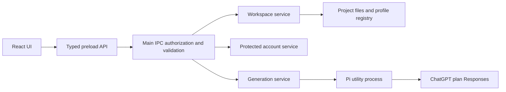

# Learning Studio

A desktop learning workspace targeting Windows, macOS, and Linux, built with Electron, React, and TypeScript. Project and account services run in Electron main; bounded Pi generation runs in a utility process. The interface pairs a slim control rail and compact project navigation with a spacious workspace inspired by the supplied ChatGPT screenshots.

The working slice includes a ChatGPT account panel with browser sign-in, verified identity, plan-usage permission, model discovery, and sign-out. Native folder projects, portable learning goals, separate model preferences, and missing-folder recovery are implemented. Description-to-outline generation uses the Pi harness in a dedicated utility process, with validated saves, cancellation, and retryable save failures. Outlines can begin with a written topic, supported folder material, or both. Scoped text/Markdown reads, source coverage, and clarification are implemented; the PRD baseline has passed native automated journeys and packaging on Windows, macOS and Linux; live-provider acceptance remains in progress. The subsequent Light/Dark UI update has separate validation recorded below.

The title strip provides **Back**, **Forward** and the sidebar toggle. Windows/Linux also show File/Edit/View/Help, compacted into **Menu** at narrow widths; macOS retains the system application menu and native window buttons. Menu commands, shortcuts and existing project controls share guarded navigation. History holds up to 100 dashboard/project/saved-topic visits for this app session, using profile project handles rather than names, paths or portable `.edu` IDs. Returning loads current saved content and restores retained drafts, disclosures, reading position and focus. It does not undo saves or start inference. Leaving project-owned AI work offers **Stay here** or **Cancel and switch**; Saving rejects departure and requires a fresh command after settlement. See the [navigation journey](ref/flows/navigation/index.md), [acceptance](ref/work/03-menus-and-navigation/acceptance.md) and [validation](ref/work/03-menus-and-navigation/validation.md) for local Windows evidence and unresolved native window/menu/accessibility qualifications on Windows, macOS and Linux.

All five AI actions—creating an outline, rewriting the whole outline or one topic, and testing Sol or Luna—use the bottom workbench panel. It shows actual activity, elapsed time and a selectable provisional preview; model tests show status evidence without reply text or project material. Accepted submissions reveal the panel immediately, including tests started from the dashboard. One AI operation owns the app at a time, so other AI actions are paused while saved reading, disclosure and Appearance remain usable. **Cancel** waits for owned worker cleanup; it is unavailable during **Saving**. Failed saves keep the accepted result for **Retry save**, which makes no new AI request. Dismiss hides a settled panel without discarding domain-owned recovery state.

Receiving inference has no total elapsed cutoff. Each request aborts after 180 seconds without received body bytes; comments and fragmented events count, while an open silent connection or local process heartbeat does not. A waiting hint after 30 seconds is nonterminal. Separate worker-health checks detect an unresponsive process. A preview or HTTP 200 does not establish a saved outline or verified model: completion, clean EOF and independent validation still apply. See the [AI lifecycle](ref/patterns-ai.md), [actual long-stream flow](ref/flows/ai-streaming/index.md) and [streaming validation](ref/work/02-ai-streaming/validation.md) for Windows fixture/package evidence and remaining live/native qualifications.

Open **Settings → Appearance** (gear icon, or **⌘/Ctrl+,**) to choose Light or Dark. Your choice applies immediately and is remembered on this device. With no saved choice, the app starts with the OS appearance.

**Settings → OpenRouter** accepts your own ordinary inference key for images, separately from the ChatGPT connection. Choose GPT Image 2, Seedream 5 Pro or Nano Banana 2. Settings shows cached model capabilities/prices, a labelled one-image estimate, exact app-reported costs and unresolved costs, separately labelled key-wide usage, and paginated request history/details. Save validates the key without generating an image; explicit Refresh checks metadata and retains last-known values on failure. Key removal preserves history. The saved key is never displayed; an unsaved password draft clears when Settings closes. Images send their prompts to OpenRouter and its serving provider. See the [Settings journey](ref/flows/openrouter-settings/index.md) for isolated local evidence; chapter reader and image replacement integration remain pending in [bundle 05](ref/work/05-illustrated-topic-content/illustrated-topic-content.spec.md).

Use **Edit outline** above **Your learning path** to rewrite a saved outline. Describe changes freely or refer to numbered topics, such as “Move 01 after 03”. **Rewrite outline** uses the selected project model and sends the current outline JSON as context; Pi reads further supported material as needed. A successful save updates `.edu/project.json`. Cancellation/failure preserves the prior outline and edit draft; a save failure retains the new result for storage-only retry. This uses your ChatGPT plan allowance. See [ADR-0017](ref/ADRs/ADR-0017-outline-rewrites-with-saved-context.md).

Each topic has independent **Open topic** and **Edit topic** commands. **Open first topic** follows the saved recommended starting topic, which may differ from the first row. Reading displays current saved questions, objectives, prerequisites, module plans and sources offline without an account or inference. Back/Forward restores reading context; deleted topics return to the current outline with an explanation. Same-project saved reading remains usable during Receiving, Cancelling and Saving. See the [topic-reading journey](ref/flows/topic-reading/index.md). **Rewrite topic** accepts requests such as “I would like to learn further history on this topic”, updates only that topic and its own folder, and preserves other topics and outline sections. Topic drafts are separate from each other and the whole-path draft. Existing root folders are matched by the topic ID, title, numbered title, saved topic-plan identity or an exclusive source-folder reference; ambiguous or shared folders require resolution. A matching folder receives an updated `.edu/topic.json` plan and any relevant content edits proposed by Pi. Renaming the topic keeps its existing folder association.

Pi can browse/read throughout the selected project and create or edit UTF-8 text content and parent folders. General outline requests can apply requested content changes across the project; topic edits restrict writes to their own folder while allowing project-wide reading for context. Writes are staged until the outline is validated. Cancellation, clarification or inference failure saves none of them. Save failures retain edits for retry without inference; an interrupted multi-file save is recovered on the next project load. File-size, path, link and external-edit checks still apply. Root application state is saved by the app. See [ADR-0019](ref/ADRs/ADR-0019-topic-edits-and-project-file-access.md).

Use **Connect ChatGPT** to connect an eligible account. During sign-in, **Copy sign-in link** lets you paste the link into your preferred browser if automatic browser opening does not work (for example, in WSL). Keep the app open while completing sign-in. Your connection is saved in the app data directory and restored after restart. Credentials use OS encryption where available; otherwise the account panel identifies the unencrypted local-file fallback. On Linux/WSL the connection folder and files are restricted to your user. Automated tests exercise a local signed-token protocol fixture; real ChatGPT-plan inference remains a separate acceptance gate.

Current UI references are organized by [documented Playwright flow](ref/patterns-flow.md). See [Appearance](ref/flows/appearance/index.md) for Light/Dark workspace and settings captures, [Outline](ref/flows/outline/index.md) for saved learning documents and [Topic editing](ref/flows/topic-edit/index.md) for the scoped editor. Passing desktop tests replace their flow/platform screenshots and regenerate capture tables; the AI maintains each journey explanation after reviewing changes.

## Product direction

The [product overview](docs/overview.md) describes the education harness and its Socratic learning approach. The [first milestone PRD](ref/prds/01-project-setup-and-outline.md) defines functional ChatGPT plan access, folder-based projects, model selection, and saved AI-generated outlines. The [acceptance audit](ref/work/01-project-setup-and-outline/acceptance.md) maps these requirements to code, tests, and remaining live-account and manual platform checks.

Future UI changes follow the screenshot-led [design system](ref/patterns-design-system.md), scoped [main-workspace standard](ref/patterns-main-workspace.md) and [UX patterns](ref/patterns-ux.md). Current central pages use shared editorial headers, opaque Light/Dark surfaces and quiet labelled commands; future central features follow its primitive/state/navigation/AI/evidence checklist. Existing panels, dialogs, title strip and AI dock retain their designs. The Sculpted aperture replaces existing brand artwork and native icon resources; [asset/export guidance](assets/branding/README.md) and [bundle 04 validation](ref/work/04-main-workspace-design/validation.md) separate implemented resources from unrun native/live/manual qualifications. The [Light/Dark appearance update](ref/research/chatgpt-app-appearance.md) applies the user-supplied references; full milestone evidence is tracked in the [implementation validation record](ref/work/01-project-setup-and-outline/validation.md).

The project picker includes **GPT-6.1 Sol** (`gpt-6.1-sol`) and **GPT-6 Luna** (`gpt-6-luna`) as extra choices whenever the connected account's catalogue loads successfully. Both remain selectable after refresh and restart even if discovery omits them. These explicitly requested choices do not assert access for every account: each inference request still uses the connected account and can be rejected by the provider. No reply request runs automatically when loading, selecting or refreshing models.

Open **Account settings → Test GPT-6.1 Sol** or **Test GPT-6 Luna** to check access with a short reply using a small amount of your plan allowance. Successful tests show a separate verification state for each model during the current connection session. Failed or cancelled tests preserve both choices and any other model's successful verification. Refresh retains verification; reconnect and restart reset verification badges while keeping the extra choices. Tests send no learning-project content.

For troubleshooting, run the app with `npm run dev`, repeat the selected test, and copy the single `[Sol model test]` or `[Luna model test]` JSON summary from the launch terminal together with the visible model-test message. It reports HTTP status, stream event counts, known returned model/status values, recognized provider error codes, boolean text evidence (`hasStreamedText` and `hasFinalText`), byte count, elapsed time and the specific outcome. A matching completed response can verify text delivered in deltas even when the final event omits its output array, after clean EOF and actual worker exit. Byte/semantic-age counters and worker-health events distinguish provider silence from a stopped process; byte receipt alone does not prove useful progress. Tokens, account identity, request headers, prompts, reply text and raw provider errors are excluded. Unrecognized provider values are labeled `unrecognized`. Unpackaged runs also save the summary as a structured `model.test` event in the development log. A missing completion, incomplete reply or model mismatch remains inconclusive; an explicit `model_not_found` identifies a provider rejection for this connection. Do not copy the saved connection file or full unrelated terminal output.

## Development logs

`npm run dev` automatically writes UTF-8 JSONL files to `logs` inside the app data directory (Windows: `%APPDATA%\Learning Studio\logs`). The launch terminal prints the actual directory. Unpackaged previews and desktop tests also log; tests use their isolated profile. Packaged apps do not enable development file logging. No additional setup or dependency is required.

Each line has `schemaVersion`, UTC `timestamp`, `sessionId`, `sequence`, main `pid`, `level`, `source`, `event`, and `data`. Logs cover startup/shutdown, windows, IPC outcomes/timings, account/workspace/generation state, utility lifecycle, material counts, inference transport/terminal events, tool names/turns, model-test summaries, renderer/preload failures and console occurrence metadata. Match `data.requestId` to follow one IPC request through provider/utility work; use `workerId` for a worker and `runId`/`projectId` for generation state.

Files rotate at 5 MiB; the ten most recent owned files are retained across launches (about 50 MiB maximum). A bounded queue reports `logging.dropped` during overload. File writes are asynchronous; unavailable storage prints a fixed warning and the app continues. Normal shutdown waits up to two seconds for pending rows, while forced exits can lose buffered diagnostics. Main fatal exceptions get a synchronous safe marker.

Logs exclude credentials, account identity, URLs/paths, request/reply bodies, prompts, outlines, source material and raw provider/error messages. Arbitrary console strings/objects record occurrence/length metadata; known structured diagnostics retain their safe details. Error records retain type and the first app bundle line/column, without message, function names or absolute stack paths. External npm/Vite output and Chromium's raw debug streams are outside these application logs. See [ADR-0018](ref/ADRs/ADR-0018-development-file-diagnostics.md).

Read the current launch in PowerShell:

```powershell
$logFile = Get-ChildItem -LiteralPath "$env:APPDATA\Learning Studio\logs" -Filter 'session-*.jsonl' |
  Sort-Object Name | Select-Object -Last 1
Get-Content -LiteralPath $logFile.FullName -Wait
# Filter already-written rows by event:
Get-Content -LiteralPath $logFile.FullName | ConvertFrom-Json |
  Where-Object event -eq 'ipc.failed' | Format-List
```

## Saved connection

Login information is stored in `connection/chatgpt.json` under the app data directory:

- Linux/WSL: `~/.config/Learning Studio` (or `$XDG_CONFIG_HOME/Learning Studio`).
- Windows: `%APPDATA%\Learning Studio`.
- macOS: `~/Library/Application Support/Learning Studio`.

The app restores the connection and refreshes expired access tokens when possible. **Sign out of this app** removes the saved credentials. A revoked connection or unreadable credential file still requires reconnecting. On devices without OS keychain encryption, the file is unencrypted and relies on filesystem permissions; account settings disclose this. Login information never belongs in a learning project's `.edu` folder.

## Open-source privacy

Keep credentials, copied application profiles, private learning projects, local logs, and signing keys out of contributions. `.gitignore` excludes these common locations and file types, but it does not remove previously tracked files or protect files added with force. Use isolated test data in screenshots and diagnostic artifacts, review their visible content, and use a GitHub noreply email for commits if you do not want your personal email published.

The [privacy audit](ref/research/privacy-audit.md) records the reviewed source/history/artifacts, local cleanup, and remaining public-history exposure. Deleting private material in a new commit does not erase it from older commits, other branches, forks, or cached copies.

## Run locally

Use Node.js 24+ and npm. Node is a development requirement; a packaged app contains its own runtime.

```bash
npm ci
npm run dev
```

`dev` starts a loopback Vite server and the desktop window, with renderer refresh and main/preload rebuilds. The development server uses `127.0.0.1:5173` and fails if the port is occupied. Open the Electron window to use the app; the renderer expects its preload bridge.

The install hook downloads Electron's desktop binary, which electron-vite requires before launch. For an existing dependency tree installed before this hook was added, run `npm run postinstall` once. Future `npm ci`/`npm install` runs perform this setup automatically.

The `Local: http://127.0.0.1:5173/` line means the renderer server started successfully. To stop it from another terminal or free the port before restarting:

```bash
npm run kill-dev
npm run dev
```

`kill-dev` prints and stops whichever process owns TCP port 5173, along with its child processes, including another application occupying that port. It succeeds when the port is already free. On Linux/macOS it first requests termination, then forces surviving processes to exit after three seconds; Windows terminates through Node's process API. Process identities are checked again before signalling.

```bash
npm run kill-dev -- --dry-run      # show targets without stopping them
npm run kill-dev -- --port 5174    # free a different TCP port
```

The script runs directly with Node 24 and has no additional npm dependencies. It uses `ss` on Linux (with `lsof` fallback), `lsof` on macOS, and PowerShell on Windows. It reports errors when it cannot identify or stop the listener. Clearing a different port does not change the application's configured development port.

```bash
npm run check          # lint, focused tests, both type scopes, production build
npm run test:desktop   # build, exercise Electron and refresh passing flow references
npm run test:flows     # check flow registration, reference indexes and screenshots
npm start             # open the most recent production build
npm run package       # build an unpacked app for the current OS in dist/
npm run test:packaged # exercise the packaged Pi worker after packaging
```

On headless Linux, run desktop tests with `xvfb-run -a npm run test:desktop`; Electron's normal desktop system libraries are required. No browser download is needed for this smoke test because Playwright drives Electron's bundled Chromium.

## Source map

```text
src/
  main/                 Electron lifecycle and Node backend composition
    auth/               Protected ChatGPT account and provider adapters
    storage/            Atomic project and profile persistence
    ipc/                Authorized request handlers
    security/           CSP, trusted-origin policy, local asset protocol
  preload/              Small typed contextBridge capability API
  renderer/
    index.html
    src/
      app/              Workbench and navigation
      components/       Shared visual pieces
      features/projects/ Dashboard, setup, outline, and saved-topic views
      features/account/  Account connection panel
      lib/              Typed bridge result handling
  core/workspace/       Platform-independent project service and storage ports
  core/generation/      Run ownership, result acceptance, save recovery
  shared/               DTOs, channels, errors, runtime request parsers
tests/
  unit/                 Core behavior and boundary policy
  desktop/              Real Electron journeys
  flows/                Flow catalog, capture fixture and publishing reporter
ref/
  patterns.md           Pattern index
  patterns-*.md         Focused current rules
  flows/<flow-id>/       Journey explanation, latest platform captures and metadata
  ADRs/INDEX.md          Decision index
  ADRs/ADR-*.md          Numbered decisions and rationale
  research/             Source-linked research and validation evidence
```

The layout follows electron-vite's process directories. Core and shared are small project-specific additions that keep behavior testable and the renderer unprivileged. Renderer-only dependencies are bundled and installed as development dependencies so the shipped app contains the bundles rather than a redundant dependency tree.

## Architecture



Use [AGENTS.md](AGENTS.md) for progressive discovery, [patterns](ref/patterns.md) for current rules, [ADRs](ref/ADRs/INDEX.md) for rationale, and the [research brief](ref/research/electron-learning-app.md) for primary sources and alternatives. The [validation record](ref/research/validation.md) distinguishes actual local results from configured platform targets.

## Distribution

Run the matching command on its target OS:

```bash
npm run dist:win       # Windows NSIS installer
npm run dist:mac       # macOS DMG
npm run dist:linux     # Linux AppImage
```

These commands never publish. The included GitHub Actions workflow checks and packages on native Windows/macOS/Linux runners, uploading unsigned build artifacts. It is a CI baseline, not a public release pipeline. Final app identity/icons, Windows signing, macOS signing/notarization, architecture coverage, installer acceptance, and update policy remain release work.

## Extend the workspace

Add learning behavior to core, define a serializable request/result in shared, expose one preload method, authorize/validate it in main, then implement its renderer state using the [main-workspace recipe and future-page checklist](ref/patterns-main-workspace.md) for central pages and the existing shared history for destinations. Async ports separate workspace behavior from project files and the profile registry. Every future inference producer must follow the [sanctioned profile, synchronous shared lease, Pi streaming and workbench-panel recipe](ref/patterns-ai.md), with explicit submission, main authorization, independent domain acceptance and awaited cancellation/settlement. Expensive parsing, indexing, or inference belongs in workers/utility processes rather than blocking Electron main.
