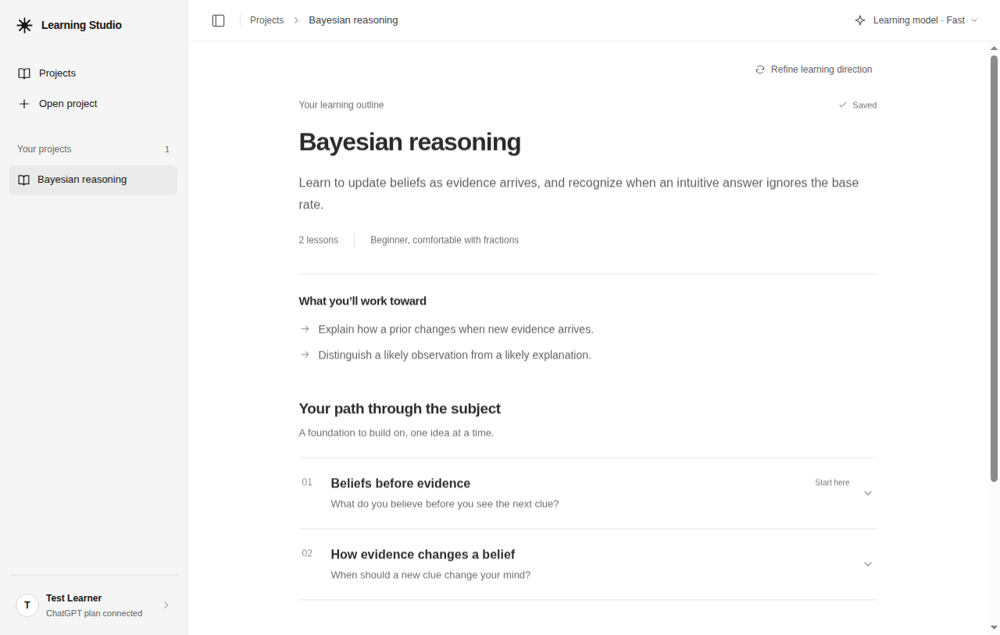
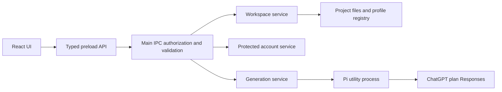

# Learning Studio

A basic desktop learning workspace for Windows, macOS, and Linux, built with Electron, React, and TypeScript. The Node.js backend runs inside Electron main. The interface pairs compact project navigation with a spacious workspace inspired by Codex.

The working slice includes a ChatGPT account panel with browser sign-in, verified identity, plan-usage permission, model discovery, and sign-out. Native folder projects, portable learning goals, separate model preferences, and missing-folder recovery are implemented. Description-to-outline generation uses the Pi harness in a dedicated utility process, with validated saves, cancellation, and retryable save failures. Outlines can begin with a written topic, supported folder material, or both. Scoped text/Markdown reads, source coverage, and clarification are implemented; live/native acceptance remains in progress.

Use **Connect ChatGPT** to connect an eligible account. Credentials use protected operating-system storage where available; otherwise the account panel explains that the connection lasts only for the app session. Automated tests exercise a local signed-token protocol fixture; real ChatGPT-plan inference remains a separate acceptance gate.



Screenshot uses deterministic test-provider content to demonstrate the interface.

## Product direction

The [product overview](docs/overview.md) describes the education harness and its Socratic learning approach. The [first milestone PRD](ref/prds/01-project-setup-and-outline.md) defines functional ChatGPT plan access, folder-based projects, model selection, and saved AI-generated outlines. These documents describe planned behavior; the working slice above remains the current implementation.

Future UI changes follow the Codex-inspired [design system](ref/patterns-design-system.md) and [UX patterns](ref/patterns-ux.md), supported by [current official-reference research](ref/research/codex-desktop-ui.md). The workspace now implements this direction; full milestone evidence is tracked in the [implementation validation record](ref/work/01-project-setup-and-outline/validation.md).

## Run locally

Use Node.js 24+ and npm. Node is a development requirement; a packaged app contains its own runtime.

```bash
npm ci
npm run dev
```

`dev` starts a loopback Vite server and the desktop window, with renderer refresh and main/preload rebuilds. The development server uses `127.0.0.1:5173` and fails if the port is occupied. Open the Electron window to use the app; the renderer expects its preload bridge.

The install hook downloads Electron's desktop binary, which electron-vite requires before launch. For an existing dependency tree installed before this hook was added, run `npm run postinstall` once. Future `npm ci`/`npm install` runs perform this setup automatically.

The `Local: http://127.0.0.1:5173/` line means the renderer server started successfully. To stop it from another terminal or free the port before restarting:

```bash
npm run kill-dev
npm run dev
```

`kill-dev` prints and stops whichever process owns TCP port 5173, along with its child processes, including another application occupying that port. It succeeds when the port is already free. On Linux/macOS it first requests termination, then forces surviving processes to exit after three seconds; Windows terminates through Node's process API. Process identities are checked again before signalling.

```bash
npm run kill-dev -- --dry-run      # show targets without stopping them
npm run kill-dev -- --port 5174    # free a different TCP port
```

The script runs directly with Node 24 and has no additional npm dependencies. It uses `ss` on Linux (with `lsof` fallback), `lsof` on macOS, and PowerShell on Windows. It reports errors when it cannot identify or stop the listener. Clearing a different port does not change the application's configured development port.

```bash
npm run check          # lint, focused tests, both type scopes, production build
npm run test:desktop   # build and exercise the real Electron application
npm start             # open the most recent production build
npm run package       # build an unpacked app for the current OS in dist/
```

On headless Linux, run desktop tests with `xvfb-run -a npm run test:desktop`; Electron's normal desktop system libraries are required. No browser download is needed for this smoke test because Playwright drives Electron's bundled Chromium.

## Source map

```text
src/
  main/                 Electron lifecycle and Node backend composition
    auth/               Protected ChatGPT account and provider adapters
    storage/            Atomic project and profile persistence
    ipc/                Authorized request handlers
    security/           CSP, trusted-origin policy, local asset protocol
  preload/              Small typed contextBridge capability API
  renderer/
    index.html
    src/
      app/              Workbench and navigation
      components/       Shared visual pieces
      features/projects/ Dashboard, setup, and outline views
      features/account/  Account connection panel
      lib/              Typed bridge result handling
  core/workspace/       Platform-independent project service and storage ports
  core/generation/      Run ownership, result acceptance, save recovery
  shared/               DTOs, channels, errors, runtime request parsers
tests/
  unit/                 Core behavior and boundary policy
  desktop/              Real Electron smoke journey
ref/
  patterns.md           Pattern index
  patterns-*.md         Focused current rules
  ADRs/INDEX.md          Decision index
  ADRs/ADR-*.md          Numbered decisions and rationale
  research/             Source-linked research and validation evidence
```

The layout follows electron-vite's process directories. Core and shared are small project-specific additions that keep behavior testable and the renderer unprivileged. Renderer-only dependencies are bundled and installed as development dependencies so the shipped app contains the bundles rather than a redundant dependency tree.

## Architecture



Use [AGENTS.md](AGENTS.md) for progressive discovery, [patterns](ref/patterns.md) for current rules, [ADRs](ref/ADRs/INDEX.md) for rationale, and the [research brief](ref/research/electron-learning-app.md) for primary sources and alternatives. The [validation record](ref/research/validation.md) distinguishes actual local results from configured platform targets.

## Distribution

Run the matching command on its target OS:

```bash
npm run dist:win       # Windows NSIS installer
npm run dist:mac       # macOS DMG
npm run dist:linux     # Linux AppImage
```

These commands never publish. The included GitHub Actions workflow checks and packages on native Windows/macOS/Linux runners, uploading unsigned build artifacts. It is a CI baseline, not a public release pipeline. Final app identity/icons, Windows signing, macOS signing/notarization, architecture coverage, installer acceptance, and update policy remain release work.

## Extend the skeleton

Add learning behavior to core, define a serializable request/result in shared, expose one preload method, authorize/validate it in main, then implement its renderer state. Async ports separate workspace behavior from project files and the profile registry. Add AI access through a privileged adapter with explicit submission and bounded lifecycle. Expensive parsing, indexing, or inference belongs in workers/utility processes rather than blocking Electron main.
