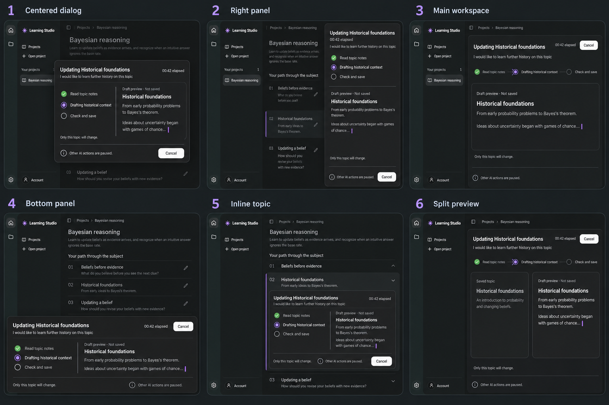

# Generation streaming: design exploration

Status: first comparison round; no selected direction or implementation authorization.

## Brief

Make AI generation visible through current activity and a developing readable draft. Explore a panel and main-workspace arrangements with muted saved content. Use Learning Studio's existing dark palette, document hierarchy, rail and project navigation. The sample is a topic rewrite requesting historical context; the eventual surface should also accommodate initial outlines and whole-outline rewrites.

Recommended concurrency behavior, pending final user agreement: one AI call at a time across the app; other AI actions disabled until completion or cancellation. Keep saved content readable. Navigation retains existing Stay here / Cancel and switch recovery. Dimming alone must not communicate the restriction: pair disabled AI controls with explicit text. Closing or minimizing a surface, if provided, must not silently cancel its run.

Every concept shows the affected topic, learner request, measured elapsed time, actual reported activity, Cancel, a provisional draft and the paused-AI explanation. Draft content is not persisted or authoritative; maintain the saved document until validation and save succeed. No invented completion percentages or ETA. Raw JSON, developer logs and private thinking are excluded from ordinary learner UI.

## Sheet 01 directions

1. Centered dialog: strongest continuation from the edit dialog and clear focus, but blocks reading behind it.
2. Right panel: persistent generation alongside saved context; recommended general starting point. Needs a full-width or overlay adaptation at narrow widths and high zoom.
3. Main workspace: gives substantial space to developing content; especially useful for initial outline creation. Saved context receives less emphasis.
4. Bottom panel: retains the outline above a horizontal activity and preview area. Vertical reading space becomes constrained.
5. Inline topic: clearest association with a specific topic; may be out of view after scrolling and needs a discoverable global running indicator. Not sufficient by itself for initial or whole-outline generation.
6. Split preview: compares the prior topic with its developing replacement; requires more width and a stacked layout on smaller viewports.

## Inspection and limits

The generated sheet has six distinct options in the requested 3-column by 2-row arrangement. Each includes elapsed time, Cancel, a draft label, actual activity examples and paused-AI copy. The raster uses curly apostrophes and typographic middle dots in places rather than reproducing all punctuation literally.

Option 4's generated dock spans the sidebar as well as the main workspace; the intended design would dock only within the main workspace. Disabled pencil affordances are not visually explicit in every miniature; an implementation must show disabled state and prevent submissions independently. The topic synopsis in some background rows also resembles the new draft: the implemented background must retain saved content until publication.

These are AI-generated design references, not working application captures or evidence of accessibility, exact pixel tokens, streaming performance or functional locking. Light-theme, keyboard/focus, zoom, reduced motion, waiting-without-output, checking, saving, error, cancellation and unsaved recovery states remain to be designed and verified after selection.

## Generation record

Method: built-in image generation, with inspected project screenshots as style and outline-structure references.

- [Contact sheet](generation-streaming-sheet-01.png)
- [Exact generation prompt](generation-streaming-prompt-01.txt)
- References: `ref/research/assets/appearance-workspace-dark.png` and `ref/research/assets/outline-workspace.png`.

Next decision: select a numbered direction or identify specific traits to combine. No standalone final reference or selection handoff has been produced yet.
