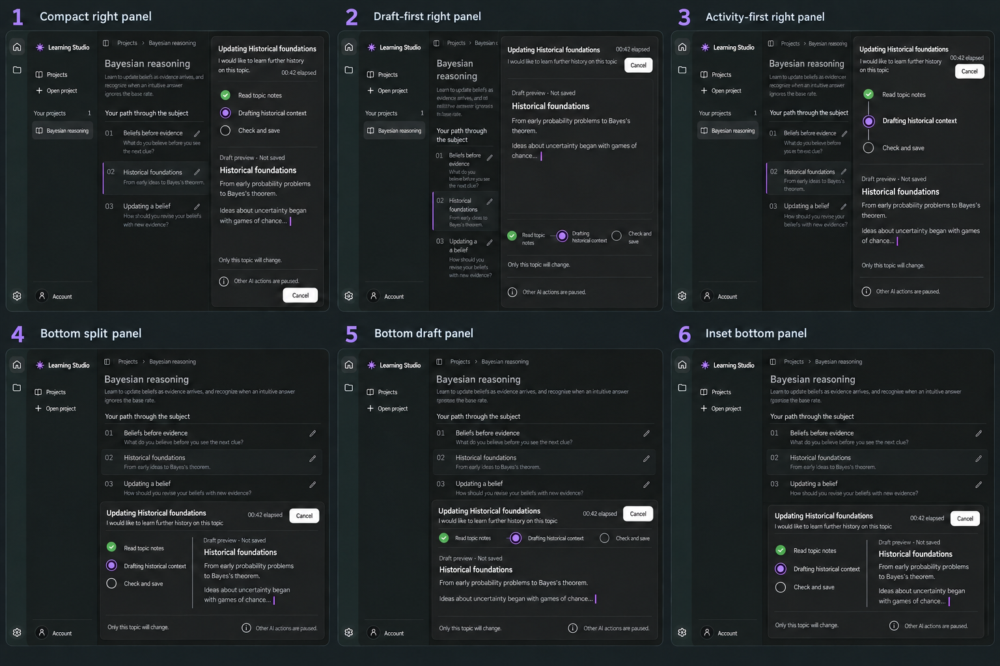

# Generation streaming: design exploration

Status: user accepted revision 03 on October 5, 2026. See the [final design selection](generation-streaming-selection.md). Application implementation remains a separate task.

## Brief

Make AI generation visible through current activity and a developing readable draft. Explore a panel and main-workspace arrangements with muted saved content. Use Learning Studio's existing dark palette, document hierarchy, rail and project navigation. The sample is a topic rewrite requesting historical context; the eventual surface should also accommodate initial outlines and whole-outline rewrites.

Recommended concurrency behavior, pending final user agreement: one AI call at a time across the app; other AI actions disabled until completion or cancellation. Keep saved content readable. Navigation retains existing Stay here / Cancel and switch recovery. Dimming alone must not communicate the restriction: pair disabled AI controls with explicit text. Closing or minimizing a surface, if provided, must not silently cancel its run.

Every concept shows the affected topic, learner request, measured elapsed time, actual reported activity, Cancel, a provisional draft and the paused-AI explanation. Draft content is not persisted or authoritative; maintain the saved document until validation and save succeed. No invented completion percentages or ETA. Raw JSON, developer logs and private thinking are excluded from ordinary learner UI.

## Sheet 01 directions

1. Centered dialog: strongest continuation from the edit dialog and clear focus, but blocks reading behind it.
2. Right panel: persistent generation alongside saved context; recommended general starting point. Needs a full-width or overlay adaptation at narrow widths and high zoom.
3. Main workspace: gives substantial space to developing content; especially useful for initial outline creation. Saved context receives less emphasis.
4. Bottom panel: retains the outline above a horizontal activity and preview area. Vertical reading space becomes constrained.
5. Inline topic: clearest association with a specific topic; may be out of view after scrolling and needs a discoverable global running indicator. Not sufficient by itself for initial or whole-outline generation.
6. Split preview: compares the prior topic with its developing replacement; requires more width and a stacked layout on smaller viewports.

## Inspection and limits

The generated sheet has six distinct options in the requested 3-column by 2-row arrangement. Each includes elapsed time, Cancel, a draft label, actual activity examples and paused-AI copy. The raster uses curly apostrophes and typographic middle dots in places rather than reproducing all punctuation literally.

Option 4's generated dock spans the sidebar as well as the main workspace; the intended design would dock only within the main workspace. Disabled pencil affordances are not visually explicit in every miniature; an implementation must show disabled state and prevent submissions independently. The topic synopsis in some background rows also resembles the new draft: the implemented background must retain saved content until publication.

These are AI-generated design references, not working application captures or evidence of accessibility, exact pixel tokens, streaming performance or functional locking. Light-theme, keyboard/focus, zoom, reduced motion, waiting-without-output, checking, saving, error, cancellation and unsaved recovery states remain to be designed and verified after selection.

## Generation record

Method: built-in image generation, with inspected project screenshots as style and outline-structure references.

- [Contact sheet](generation-streaming-sheet-01.png)
- [Exact generation prompt](generation-streaming-prompt-01.txt)
- References: `ref/research/assets/appearance-workspace-dark.png` and `ref/research/assets/outline-workspace.png`.

## Sheet 02: right and bottom panel refinement

User feedback: likes sheet 01 options 2 and 4; wants the bottom panel contained within the main window's content region.

Preserved dark palette, app shell, activity and draft content, elapsed time, Cancel and paused-AI copy. The top row compares compact, draft-first and activity-first right panels. The bottom row compares a split activity/preview dock, a wide prose dock with compact phase strip, and an inset panel. All bottom panels are confined to the main workspace, leaving navigation visible to the bottom of the window.

The first generation of sheet 02 still extended option 6 into navigation. A targeted image edit corrected that panel's bounds. The inspected saved sheet now keeps each bottom panel to the right of the sidebar. Generated miniature copy and background content remain approximate; the saved topic must remain unchanged in an implementation, and disabled AI affordances need explicit visual and functional treatment.

Suggested next comparison: sheet 02 option 4 emphasizes activity beside the draft; option 5 gives streamed prose more horizontal space. No final direction has been chosen.

- [Sheet 02](generation-streaming-sheet-02.png)
- [Sheet 02 before boundary correction](generation-streaming-sheet-02-before-repair.png)
- [Generation prompt](generation-streaming-prompt-02.txt)
- [Targeted repair prompt](generation-streaming-prompt-02-repair.txt)

Generation used the actual first sheet as the reference; the boundary repair used the generated second sheet as its edit target. No application implementation was changed.

## Revision 03: bottom split panel with connected activity icons

User feedback: prefers sheet 02 option 4, with the activity icons connected like option 3. Interpreted as a vertical visual connector between steps, rather than clickable hyperlinks.

The focused standalone refinement preserves the bottom panel inside the main workspace, unobstructed sidebar, left activity/right draft composition, elapsed time, Cancel and paused-AI copy. Thin vertical connectors join the completed green check, active purple circle and upcoming hollow circle. The upper saved topic retains its old synopsis while new historical prose appears only in the draft area.

Inspection confirms connected activity steps and correct panel containment. As with prior concepts, pencil icons are visually gray but their actual disabled semantics and interaction require implementation. The generated topic rows have more visible borders and the outline is less dimmed than the miniature reference; these are approximate visual details to review rather than changes to accepted application behavior.

- [Revision 03](generation-streaming-revision-03.png)
- [Exact revision prompt](generation-streaming-prompt-03.txt)

Method: built-in image generation using sheet 02 as the actual reference and explicitly selecting its options 4 and 3. No application code changed. The user subsequently approved this exact standalone image. It is preserved unchanged as [the final reference](generation-streaming-final.png), with the [selection handoff](generation-streaming-selection.md) alongside it.
