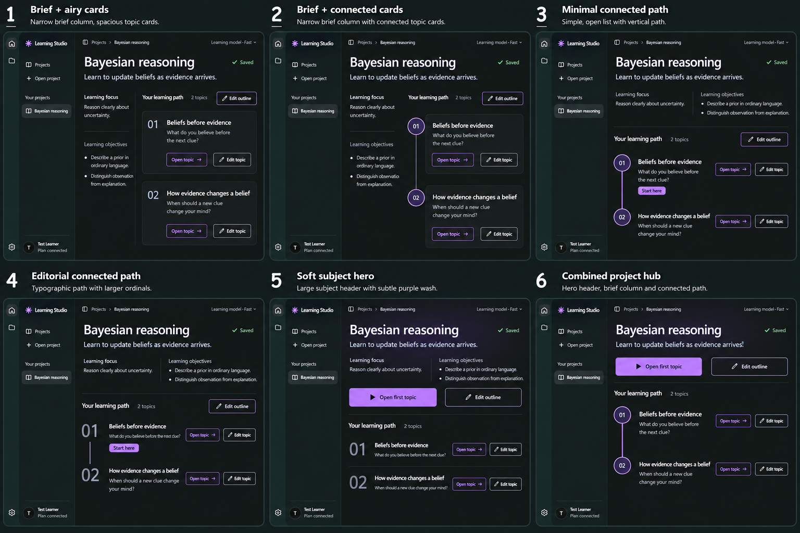
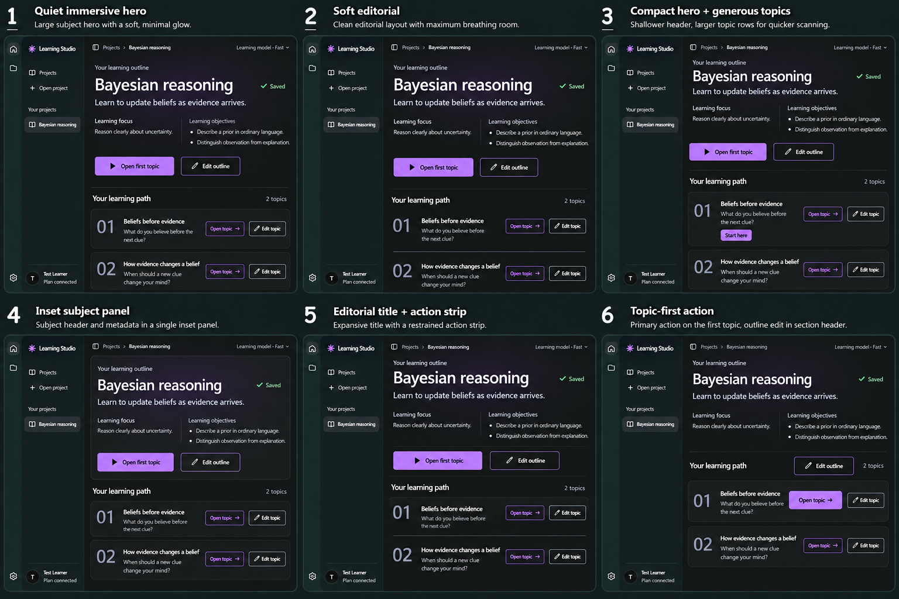

# Project overview — design exploration

Date: 2026-10-06
Status: Refinement, sheet 03; no final direction selected or implementation approval.
Method: Built-in image generation. Sheet 01 used current saved-outline/expanded-topic flow screenshots; sheet 02 uses the actual sheet 01 image, and sheet 03 uses both earlier sheets as refinement references.

## Brief

Make the first page of an opened saved project beautiful and clearly interactive. Give whole-outline editing, individual topic editing and opening a topic distinct discoverable actions. The initial round explored an inline Light/Dark appearance control after clarification of “main theme.” The latest user feedback **removes that selector from the page**. Preserve ordinary Settings access through the rail; no change to the existing appearance capability is authorized by this exploration.

Preserve Learning Studio's compact rail/project sidebar, inset workspace, neutral system typography and restrained purple accent. Compare all six directions in Dark mode, at the same scale, with the same two-topic Bayesian reasoning sample. The sheet illustrates a saved, idle project without an active or retained generation dock. Actual AI calls continue using the already approved shared bottom panel.

## Sheet 01

| Option | Direction | Useful difference |
| --- | --- | --- |
| 1 | Editorial welcome | Spacious hierarchy, prominent first-topic CTA and quiet, readable topic rows |
| 2 | Project brief + topics | Learning focus/objectives beside two clearly actionable topic tiles |
| 3 | Connected learning path | Ordered topic nodes show the proposed sequence without claiming learner progress |
| 4 | Immersive subject index | Strong subject typography and a subtle purple hero treatment with clear open/edit actions |
| 5 | Topic explorer | Select a topic in an index and read a saved-plan preview beside it |
| 6 | Action-first workspace | Open/edit actions near the top, followed by compact actionable topic rows |

Recommendation for discussion: **4** offers the strongest visual presence; **1** is the calmer, spacious alternative. These are recommendations, not user selections.

## Sheet 02 — refinements of 2, 3 and 4

The user liked sheet 01 options **2, 3 and 4**, requested alternatives or a combination, asked for a subtler glow in 4 and removed the Light/Dark selector. These are accepted exploration constraints, not a final selection.

| Option | Direction | Relationship to sheet 01 |
| --- | --- | --- |
| 1 | Brief + airy cards | Refines old 2 with a quieter context column and roomy topic cards |
| 2 | Brief + connected cards | Combines old 2's brief column and old 3's ordered topic spine |
| 3 | Minimal connected path | Refines old 3 with open rows and restrained circular order markers |
| 4 | Editorial connected path | Refines old 3 with large ordinals and typographic rows |
| 5 | Soft subject hero | Refines old 4 with a visibly reduced purple wash and clear first-topic/edit actions |
| 6 | Combined project hub | Shows the hero and connected path; the requested brief column was omitted by generation |

All six remove the inline theme selector and retain visible Edit outline, Open topic and separate Edit topic controls. The user has not selected one. Suggested next discussion: option **2** for the brief/path combination, or **5** for the subdued subject hero. New option numbers refer to sheet 02.

**Known refinement drift:** option 6 was prompted to combine all three older directions, but the generated result omitted the left learning-focus/objective column. Its caption describes the intended combination more fully than the actual image. Treat it as a hero/path hybrid; restore that column if selected. No additional round was generated before feedback.

## Sheet 03 — preferred hero family

The user continued to prefer **sheet 01 option 4** and **sheet 02 option 5**, then explicitly requested another contact sheet rather than a standalone design. This round keeps their full-width subject-first hero, side-by-side learning context, large topic ordinals and labeled actions. It varies grouping, density and action placement; the glow remains soft and the theme selector remains removed.

| Option | Direction | Useful distinction |
| --- | --- | --- |
| 1 | Quiet immersive hero | Closest to original 4, with softer glow and subtly raised topic rows |
| 2 | Soft editorial | Airy unboxed rows and thin dividers beneath the subject hero |
| 3 | Compact hero + generous topics | Shallower header gives more room to topic rows |
| 4 | Inset subject panel | One restrained surface groups title, context and top actions |
| 5 | Editorial title + action strip | Clear action band separates subject context from the topic index |
| 6 | Topic-first action | Dominant Open topic on the first row; Edit outline at the path heading |

The saved copy was visually reviewed: six complete frames, subtle purple treatment, no inline theme selector, visible whole-outline editing and separate open/edit actions for both topics. No material missing-action defect was observed in this round. Recommendation for comparison: **1** most closely preserves the original favorite; **2** is more editorial; **6** tests placing the primary action directly on its topic. These are recommendations, not a final selection.

## Action meanings and capability boundaries

- **Appearance:** existing Light/Dark behavior remains available through Settings. The inline switch shown in sheet 01 is withdrawn by user feedback and absent from sheet 02.
- **Edit outline:** open the existing whole-path rewrite interaction; actual submission follows the global admission/streaming/recovery rules.
- **Edit topic:** a separate action targeting only that stable topic and its owned folder; it must not trigger topic navigation or a whole-outline rewrite.
- **Open topic / Open first topic:** navigate into or display the saved topic plan, including objectives and module outlines. A dedicated topic destination is proposed; current implementation reads it through inline disclosure. No tutoring, lesson delivery, new AI generation, completion or mastery claim is implied.
- Recommended starting order and connected nodes describe the outline's structure, not progress.

## Visual inspection and unresolved details

All three saved sheets are 1536 × 1024, with six numbered comparable frames and distinct topic open/edit affordances. Sheets 02 and 03 have no inline theme selector; sheet 03 stays within the preferred softly illuminated hero family. Copy is readable at full size; exact spacing, tokens, keyboard behavior and accessibility remain implementation work.

**Known sheet 01 defect:** its option 5 omits the whole-outline Edit outline action. Restore it in its project/section header if that direction is later revisited. Do not interpret its absence as an agreed scope change. The current sheet 02 options all include Edit outline.

The hero gradient in sheet 01 option 4 and its quieter sheet 02 option 5 refinement are explorations, not adopted palette changes. Light-state examples, responsive/200% behavior, long titles, empty/unsaved states, AI-disabled states and focus/hover treatment have not been visually selected. Preserve the existing live panel and recovery rules in any later implementation.

## References and generation record

- [Current saved-outline flow](../../../../ref/flows/outline/index.md)
- [Saved overview screenshot](../../../../ref/flows/outline/screenshots/windows/outline-overview.png)
- [Expanded topic screenshot](../../../../ref/flows/outline/screenshots/windows/generated-outline.png)
- [Current topic-editing flow](../../../../ref/flows/topic-edit/index.md)
- [Design system](../../../../ref/patterns-design-system.md)
- [Approved generation-panel handoff](../01-generation-streaming/generation-streaming-selection.md)
- [Exact sheet 01 prompt](project-overview-sheet-01-prompt.md)
- [Exact sheet 02 prompt](project-overview-sheet-02-prompt.md)
- [Exact sheet 03 prompt](project-overview-sheet-03-prompt.md)

The exact outputs of all three generation calls were copied into this project folder; the original generated cache images and earlier sheets/prompts were preserved. No application source or flow reference was modified.

Next decision: select one option or specify qualities to combine. A final reference and selection handoff will follow explicit selection; this brief is not that handoff.
