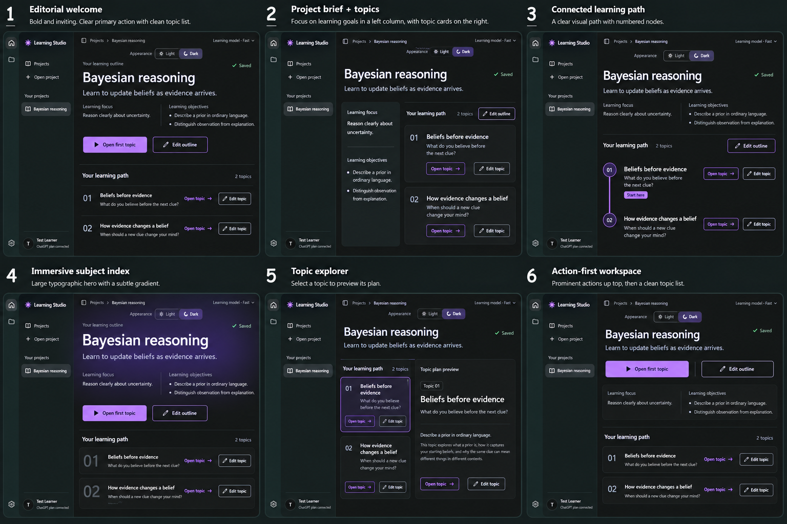

# Project overview — design exploration

Date: 2026-10-06
Status: Exploration, sheet 01; no selected direction or implementation approval.
Method: Built-in image generation, using the current saved-outline and expanded-topic flow screenshots as visual references.

## Brief

Make the first page of an opened saved project beautiful and clearly interactive. Give whole-outline editing, individual topic editing and opening a topic distinct discoverable actions. The user clarified that “main theme” means **Light/Dark visual appearance**, so expose an Appearance choice directly in the page chrome. Do not add a new main-subject editing action as a substitute.

Preserve Learning Studio's compact rail/project sidebar, inset workspace, neutral system typography and restrained purple accent. Compare all six directions in Dark mode, at the same scale, with the same two-topic Bayesian reasoning sample. The sheet illustrates a saved, idle project without an active or retained generation dock. Actual AI calls continue using the already approved shared bottom panel.

## Sheet 01

| Option | Direction | Useful difference |
| --- | --- | --- |
| 1 | Editorial welcome | Spacious hierarchy, prominent first-topic CTA and quiet, readable topic rows |
| 2 | Project brief + topics | Learning focus/objectives beside two clearly actionable topic tiles |
| 3 | Connected learning path | Ordered topic nodes show the proposed sequence without claiming learner progress |
| 4 | Immersive subject index | Strong subject typography and a subtle purple hero treatment with clear open/edit actions |
| 5 | Topic explorer | Select a topic in an index and read a saved-plan preview beside it |
| 6 | Action-first workspace | Open/edit actions near the top, followed by compact actionable topic rows |

Recommendation for discussion: **4** offers the strongest visual presence; **1** is the calmer, spacious alternative. These are recommendations, not user selections.

## Action meanings and capability boundaries

- **Light / Dark:** appearance only, no project-data change or AI call. The explicit inline switch is a proposed presentation of the existing appearance setting.
- **Edit outline:** open the existing whole-path rewrite interaction; actual submission follows the global admission/streaming/recovery rules.
- **Edit topic:** a separate action targeting only that stable topic and its owned folder; it must not trigger topic navigation or a whole-outline rewrite.
- **Open topic / Open first topic:** navigate into or display the saved topic plan, including objectives and module outlines. A dedicated topic destination is proposed; current implementation reads it through inline disclosure. No tutoring, lesson delivery, new AI generation, completion or mastery claim is implied.
- Recommended starting order and connected nodes describe the outline's structure, not progress.

## Visual inspection and unresolved details

The saved 1536 × 1024 sheet has six numbered comparable frames, visible Light/Dark controls and distinct topic open/edit affordances. Copy is readable at full size; exact spacing, tokens, keyboard behavior and accessibility remain implementation work.

**Known generated defect:** option 5 omits the whole-outline Edit outline action. Restore it in its project/section header if that direction is selected. Do not interpret its absence as an agreed scope change. No additional refinement was generated before user feedback.

The subtle gradient in option 4 is an exploration, not an adopted palette change. Light-state examples, responsive/200% behavior, long titles, empty/unsaved states, AI-disabled states and focus/hover treatment have not been visually selected. Preserve the existing live panel and recovery rules in any later implementation.

## References and generation record

- [Current saved-outline flow](../../../../ref/flows/outline/index.md)
- [Saved overview screenshot](../../../../ref/flows/outline/screenshots/windows/outline-overview.png)
- [Expanded topic screenshot](../../../../ref/flows/outline/screenshots/windows/generated-outline.png)
- [Current topic-editing flow](../../../../ref/flows/topic-edit/index.md)
- [Design system](../../../../ref/patterns-design-system.md)
- [Approved generation-panel handoff](../01-generation-streaming/generation-streaming-selection.md)
- [Exact sheet 01 prompt](project-overview-sheet-01-prompt.md)

The exact output of this generation call was copied into this project folder; the original generated cache image was preserved. No application source or flow reference was modified.

Next decision: select one option or specify qualities to combine. A final reference and selection handoff will follow explicit selection; this brief is not that handoff.
