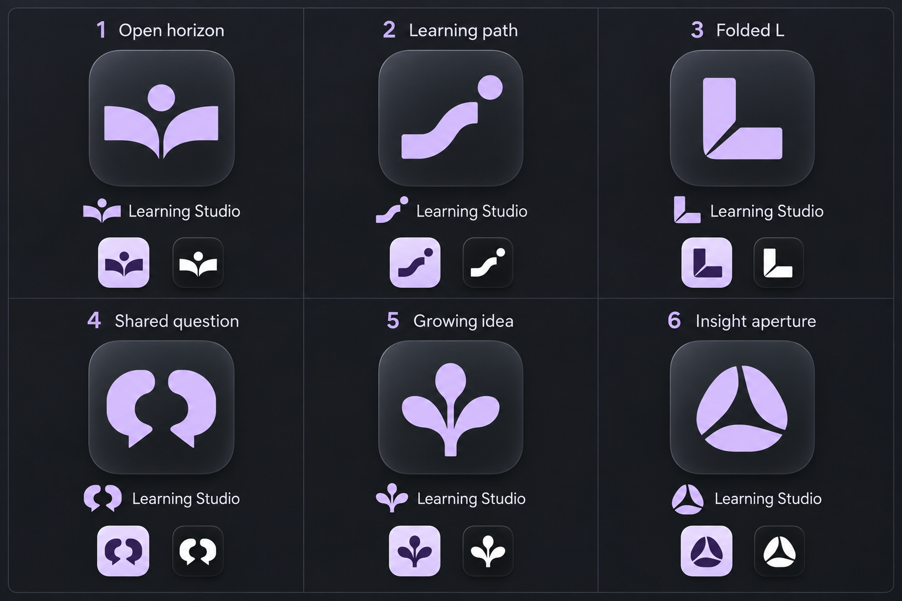
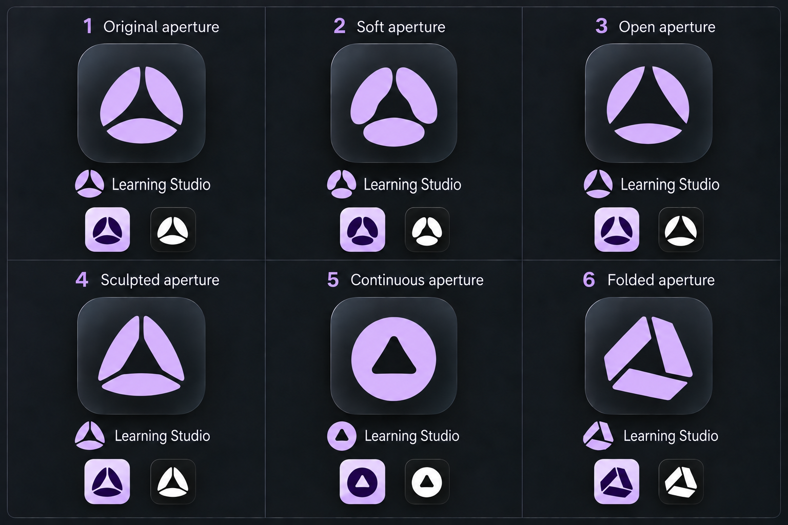

# Learning Studio logo — exploration

Date: 2026-10-06
Updated: 2026-10-07
Status: Locked — sheet 02 option 4, Sculpted aperture; standalone reference and handoff saved, implementation planned.
Method: Built-in image generation. Sheet 01 used no image references; sheet 02 used the actual sheet 01 image followed by two focused corrections of its generated output.

## Brief

Explore six logos for Learning Studio that can become recognizable app icons and compact in-app brand marks. Use the established charcoal/lilac direction and the selected main-workspace design's restrained glass feel for presentation tiles. Keep the actual symbol simple enough to work in one color. The project name remains **Learning Studio**.

The current [Mark component](../../../../src/renderer/src/components/Mark.tsx) uses a radial spark. This is an exploration of replacement identities, not an edit to that SVG or to application branding. No panels, workspace UI, icon packaging or source files are changed.

## Sheet 01

| Option | Direction | Useful distinction |
| --- | --- | --- |
| 1 | Open horizon | Open book and insight/sun dot: the clearest direct learning association |
| 2 | Learning path | One broad bending ribbon and endpoint: compact, abstract exploration |
| 3 | Folded L | Strong L silhouette with a page-like fold: the simplest letter-based icon |
| 4 | Shared question | Two facing speech forms: conversation and examination of ideas |
| 5 | Growing idea | Three connected broad tips: growth and connected understanding |
| 6 | Insight aperture | Three curved blades around negative space: abstract discovery/clarity |

Each panel uses comparable presentation: large app tile, symbol + Learning Studio wordmark, light purple/dark-symbol miniature and dark/white-symbol miniature. These previews are generated concepts, not measured 16/24/32px rasterization tests.

Recommendation for feedback: **3** has the strongest compact silhouette; **1** communicates learning most immediately; **6** offers the most abstract direction. Recommendations are not selections.

## Sheet 02 — aperture variations

The user likes **sheet 01 option 6 — Insight aperture** and requested another contact sheet containing that original plus variations inspired by it. On this sheet, **option 1 corresponds to the previous option 6**. The three-page aperture identity, charcoal/lilac palette and comparable tile/wordmark presentation remain the constraints.

| Option | Direction | Useful distinction |
| --- | --- | --- |
| 1 | Original aperture | Carries forward the old #6 curved three-blade mark as the comparison anchor |
| 2 | Soft aperture | Rounded blade ends and a broad oval bottom piece soften the silhouette |
| 3 | Open aperture | Larger negative-space opening and slimmer separated pieces |
| 4 | Sculpted aperture | Taller, triangular outline with more pointed page forms |
| 5 | Continuous aperture | One closed circular contour with a triangular opening, replacing radial separation |
| 6 | Folded aperture | Angular page/ribbon pieces and a more directional triangular silhouette |

The initial generation varied the shapes too little. A focused correction made the silhouettes more distinct; a second corrected several small wordmark/miniature symbols to follow their main marks. The final saved output retains the original concept as option 1 and six complete numbered panels. It is a visual reference, not a pixel-exact reproduction of the previous symbol.

**Remaining preview drift:** option 4's wordmark symbol remains rounder than its triangular main mark; option 3's small variants do not fully reproduce the large mark's enlarged opening. Treat the large tile glyphs as authoritative for comparison, and all miniatures as illustrative rather than verified scaled assets. No additional round is generated before feedback. Suggested comparisons: **2** for a softer identity, **3** for a lighter version of the favorite, **6** for stronger folded-page geometry; these are not selections.

## Inspection and remaining work

The saved 1536 × 1024 sheet was inspected: all six numbered directions, complete tiles, exact brand wordmarks and two alternate miniature treatments are present. Symbols are distinct and generally preserve their form across presentations. The light preview is pale lilac rather than the white workspace background; chosen geometry should later be checked on the actual Light canvas. Main glyphs show slight tonal shading; the white miniatures demonstrate the intended one-color treatment.

The user subsequently locked **sheet 02 option 4**. The [standalone reference](learning-studio-logo-final.png) and [selection handoff](learning-studio-logo-selection.md) preserve its large triangular mark. A later implementation must create the editable vector/native exports and verify actual small sizes and platform presentation; the generated miniatures are not qualification evidence.

The saved sheet 02 is also 1536 × 1024 and was visually inspected. Labels/brand copy, complete panels and the original-plus-variations requirement are present; miniature drift is recorded above. Both sheets and their original generated cache files remain preserved. Neither sheet changes the app's current logo.

## References and generation record

- [Exact sheet 01 prompt](learning-studio-logo-sheet-01-prompt.md)
- [Sheet 02 generation and correction prompts](learning-studio-logo-sheet-02-prompt.md)
- [Exact final prompt](learning-studio-logo-final-prompt.md)
- [Locked selection handoff](learning-studio-logo-selection.md)
- [Design system](../../../../ref/patterns-design-system.md)
- [Locked main-workspace direction](../02-project-overview/project-overview-selection.md)
- [Main-workspace design contract](../../../../ref/work/04-main-workspace-design/main-workspace-design.design.md)

The exact image returned by this generation call was copied here; its original generated cache image remains preserved. No prior exploration was overwritten.

## Locked selection

The user explicitly selected **sheet 02 #4 — Sculpted aperture**, then requested adding it to the main-workspace spec. No further logo selection is pending. The large selected glyph, rather than its rounder miniature wordmark, is authoritative. The standalone saved copy was visually inspected; its three-piece triangular identity is preserved. Earlier sheets and original generation cache files remain intact.
