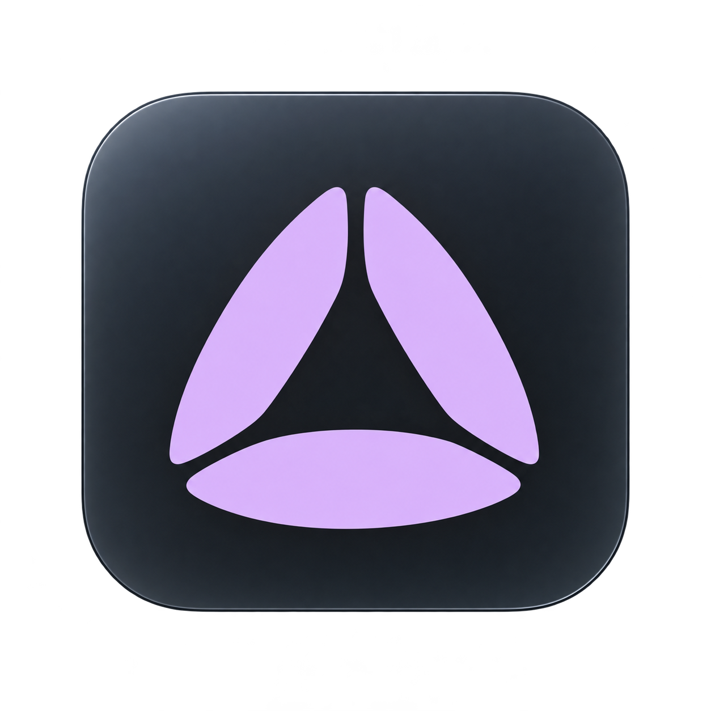

# Learning Studio Logo Design Selection

Date: 2026-10-07
Status: Locked by the user — sheet 02, option 4, Sculpted aperture. Implementation remains planned.

## Selected Direction

A triangular aperture made from three broad page-like pieces. The user explicitly selected **#4 from sheet 02** and requested its inclusion in the [main-workspace spec](../../../../ref/work/04-main-workspace-design/main-workspace-design.spec.md).

The **large tile mark** in [sheet 02](learning-studio-logo-sheet-02.png) is authoritative. Its smaller wordmark preview remained too circular; that preview is not an approved alternative.

## Final Reference

The standalone reference was generated using sheet 02's large option 4 as an actual reference and inspected after saving. It retains the upright triangular silhouette, two rising side pages, broad shallow bottom page, triangular opening and three separation gaps. Minor raster highlight/curve differences are not exact vector geometry.

The PNG has transparency outside the rounded tile; its charcoal tile remains filled. It is a design reference, not a production vector or qualified native icon bundle.

## Visual Properties

- **Geometry:** exactly three separate broad shapes; taller and more triangular than sheet 01's circular aperture. Keep the top gap and lower-left/lower-right separation. No closed ring, extra lobes, rotation or play-button replacement.
- **Palette:** restrained lilac on charcoal for the app tile. In-app mark uses existing theme-aware accent/currentColor or a contrast-safe monochrome treatment. Keep one geometry across appearances.
- **Surface:** subtle highlight and fine edge on the rounded-square app tile. The glyph itself should be flat in production; no texture, animated glow or heavy extrusion.
- **Wordmark:** exact text **Learning Studio**, using existing system-sans typography. Retain current layout and accessible control names.
- **Proportion:** generous negative space and balanced padding. Final SVG curves, optical alignment and platform export padding require implementation review rather than tracing shading as extra shapes.

## Behavior and Adaptation

This is static identity, not progress or an interactive learning action. Existing brand controls retain their behavior. Decorative marks beside named text stay hidden from assistive technology; standalone actionable uses retain meaningful accessible names.

Replace the existing brand glyph in its current slots as the only branding exception to the unchanged side-panel rule. Preserve panel dimensions, typography, controls, theme tokens and the AI dock. Do not replace functional action/status icons with this mark.

Use glyph-only artwork in the current in-app brand slot; reserve the rounded-square tile for native app icons. Light/Dark and monochrome variants keep the same silhouette. Verify actual small-size output at 16/24/32/48px and larger native sizes; generated miniatures are not that evidence.

## Implementation Handoff

The current [Mark.tsx](../../../../src/renderer/src/components/Mark.tsx) is an inline radial-spark SVG. [electron-builder.yml](../../../../electron-builder.yml) defines NSIS/DMG/AppImage targets without custom icons, and [distribution guidance](../../../../ref/patterns-distribution.md) identifies Electron's default icon as a placeholder.

The updated spec requires a clean editable vector master, shared in-app construction and reproducible Windows ICO, macOS ICNS and Linux PNG exports. Main owns any runtime window-icon resource resolution; no new preload capability is needed. Keep app ID/name, package hardening, signing, publishing and native-control policy unchanged.

Implementation must document geometry, palette variants, clear space/minimum size, authoritative asset paths, generation/export commands and consumer inventory. Review actual renderer captures and packaged icon metadata/native host presentation before claiming native qualification. No source, packaging configuration or maintained ADR was changed by this design lock.

## Iteration History

- [Sheet 01](learning-studio-logo-sheet-01.png): six distinct families; the user preferred option 6, Insight aperture.
- [Sheet 02](learning-studio-logo-sheet-02.png): original aperture plus five variants; the user locked option 4, Sculpted aperture.
- [Exploration brief](learning-studio-logo-brief.md) records corrections and remaining unselected miniature drift.
- Built-in image generation. Exact prompts: [sheet 01](learning-studio-logo-sheet-01-prompt.md), [sheet 02 and corrections](learning-studio-logo-sheet-02-prompt.md), [standalone final](learning-studio-logo-final-prompt.md).
