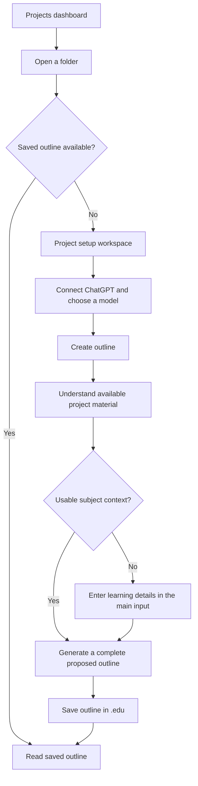

# PRD 01: Project setup and AI-generated learning outlines

Date: 2026-10-04  
Status: Implementation locally validated; live-provider and native-platform acceptance still required.

Product context: [Education Harness overview](../../docs/overview.md).

## Outcome

Extend the existing Electron desktop skeleton so a learner can connect their ChatGPT plan, open a folder as a learning project, choose its model, and generate a complete proposed learning outline from project material or a description. The outline and project metadata are saved in the project's root `.edu` folder and remain available after reopening the application.

The interface should be beautiful, simple, and intuitive, with Codex-inspired project navigation and a spacious main workspace. Successful delivery requires real plan-backed inference and real saved project state.

## Problem and starting point

At PRD authoring, the application demonstrated a desktop learning flow using three sample lessons, goal-labelled sessions, and deterministic multiple-choice feedback. Session state disappeared when the application quit. That baseline had no account connection, AI provider, project-folder opening, per-project model selection, or generated curriculum. Current implementation evidence lives in the [work validation record](../work/01-project-setup-and-outline/validation.md).

The historical baseline is recorded in [ADR-0003](../ADRs/ADR-0003-core-learning-services-and-demo-state.md). The maintained [README](../../README.md) and [learning and data patterns](../patterns-learning-data.md) describe current behavior. The project workspace replaces the original StartView/SessionView demo, and the [package manifest](../../package.json) now pins Pi dependencies.

The next useful product step is a real learning-project foundation. Someone with a folder of notes should be able to obtain a coherent learning path. Someone starting with a topic name should obtain an equally usable structure without first completing a detailed questionnaire.

This document defines the product requirements. Current ADRs and patterns describe the implemented workspace; the [acceptance audit](../work/01-project-setup-and-outline/acceptance.md) records evidence and remaining gates.

## Audience and jobs

Working audience assumption: an individual pursuing self-directed learning on their own desktop. The broader audience remains open; this milestone requires no educator, administrator, or classroom role.

The learner needs to:

- Use an existing eligible ChatGPT plan for the application's AI work.
- Establish a project from a folder and find it again later.
- Know which model the project will use.
- Turn existing material into a complete learning outline that fills relevant gaps.
- Turn a brief or detailed topic description into the same kind of outline.
- Inspect and reopen the result without generating it again.

## Scope

| Included in this milestone | Defined for later milestones |
| --- | --- |
| Functional ChatGPT sign-in and plan-usage authorization | Additional AI providers and API-key billing options |
| Project dashboard, folder opening, and reopening | Cloud sync, collaboration, and classroom management |
| Model selection remembered separately for each project | Advanced inference controls and automatic model routing |
| Content-informed or description-informed outline creation | Fully authored lessons and interactive Socratic tutoring |
| Gap filling and visible scope assumptions | Mastery scores, grading, retention scheduling, and learning analytics |
| Readable outline inspection and explicit regeneration | Full outline editor, manual lesson ordering, and conversational refinement |
| Durable `.edu` outline and project metadata | Broad document ingestion, automatic web research, and a source-library manager |
| Cancellation, useful errors, and recovery | Background agents, concurrent project runs, and automatic folder monitoring |

The sample learning flow does not satisfy any AI-generation requirement. Sample material may remain separately accessible during development, but the primary workspace must identify real project state accurately and must not imply that generated lessons can already be studied.

## Product decisions and working assumptions

- Windows, macOS, and Linux are target platforms.
- A project is a folder; Git is not required.
- All project metadata and the generated outline belong under `.edu` at that folder's root.
- Sign in with ChatGPT and ChatGPT-plan inference are required; use Pi's dedicated flow as their basis.
- Model selection belongs to the project. The account connection belongs to the application.
- Existing material is a starting point. The outline must add relevant missing foundations and coverage.
- A short topic name is sufficient input. Additional detail is optional.
- “Open project (nothing happens)” means opening the workspace without automatically starting AI analysis, generating an outline, or launching a lesson. An explicit **Create outline** action starts the AI workflow.
- The minimum supported input material is readable plain text and Markdown, including nested files. Other formats can be added later; unsupported material must be visible as a coverage limitation.
- A complete outline describes the whole proposed learning path. Full lesson content and tutoring are later capabilities.

These assumptions bound the first milestone. They should be revised explicitly if subsequent product discussion changes them.

## Main journey

Connection can happen before or after opening a project. Browsing projects and saved outlines does not require AI access. An empty project lets the learner supply a description immediately, avoiding an unnecessary failed generation attempt.

### Material-led project

1. The learner opens a folder containing relevant notes or other supported material.
2. The project appears on the dashboard and becomes the active workspace. Opening alone starts no AI work.
3. The learner connects ChatGPT if needed, sees the project's selected model, and chooses **Create outline**.
4. Pi examines the supported material. Optional learner input directs its interpretation.
5. The application shows meaningful progress while the outline is being created.
6. The result describes the inferred subject and scope, organizes lessons, and fills relevant gaps.
7. The outline is saved under `.edu` and shown as a readable document.

### Description-led project

1. The learner opens an empty folder.
2. The main workspace presents a large, labelled input field: **What would you like to learn?**
3. They enter a topic such as “Bayesian reasoning” or a detailed brief.
4. They connect ChatGPT if needed, choose the project model, and select **Create outline**.
5. The application generates the complete proposed path, states its assumptions, saves it under `.edu`, and displays it.

### Returning to a project

1. The learner chooses a project from the dashboard.
2. The workspace restores the saved outline and selected model.
3. They can read and inspect it immediately, including while offline or disconnected.
4. Changing the model updates the project choice for future work. The saved outline remains available.
5. A changed description or new material can be used in an explicit **Regenerate outline** action. The last successful outline stays available until a replacement has been generated and saved successfully.

## Functional requirements

### A. ChatGPT account and plan usage

| ID | Requirement |
| --- | --- |
| AUTH-01 | Provide **Continue with ChatGPT**, opening the browser-based sign-in and authorization experience and returning the user to the desktop application. Make the application requesting access recognizable. Ordinary completion must not require a terminal or copying tokens. |
| AUTH-02 | Distinguish being signed in from having permission to consume ChatGPT-plan usage. Show a clear recovery action when identity is connected but plan usage is unavailable. |
| AUTH-03 | Use the learner's eligible included Codex / ChatGPT Work allowance for outline generation. Explain that this shares their existing plan limits. Never silently switch to separately billed API usage. |
| AUTH-04 | Restore a usable connection after application restart, renew it where supported, and request reconnection when necessary. Preserve the learner's project and unsent description during recovery. |
| AUTH-05 | Provide understandable states for waiting for sign-in, connected, plan permission unavailable, reconnect required, ineligible access, and usage exhausted. Cancellation returns to the prior workspace. |
| AUTH-06 | Allow the learner to sign out. Local sign-out removes this application's usable credentials while preserving project files. Any distinction between local sign-out and revoking the provider connection must be clear. |
| AUTH-07 | Keep credentials outside project folders and learner-facing content. A copied project contains its educational state and model preference, never account secrets. |
| AUTH-08 | Demonstrate a real successful outline request through the authorized plan-usage connection. A completed browser flow or a connected badge alone does not satisfy functional login. |

OpenAI documents separate identity and plan permissions and identifies eligible Plus and Pro users for participating apps. Eligibility must be checked for this application's intended distribution. [Sign in with ChatGPT quickstart](https://developers.openai.com/siwc/quickstart).

### B. Dashboard and project opening

| ID | Requirement |
| --- | --- |
| PROJ-01 | Provide a dashboard listing previously opened learning projects and one clear **Open project** action. Project entries show a useful name, folder location, and outline availability. |
| PROJ-02 | Use the desktop folder-selection experience. Accept an existing or empty folder without requiring Git, a pre-created `.edu` folder, or a project template. Cancelling leaves the current workspace intact. |
| PROJ-03 | Opening makes that folder active, registers it in the dashboard, and loads any existing educational state. It must not initiate AI analysis, generation, or learning activities. Opening an uninitialized folder alone must not create educational files. |
| PROJ-04 | Reopening the same folder uses its existing dashboard entry. The dashboard remains available after quitting and relaunching the application. |
| PROJ-05 | Return between dashboard and project workspace without losing saved work. Only one outline-generation operation runs at a time in this milestone. |
| PROJ-06 | If a folder is missing or inaccessible, keep its entry recognizable and offer retry or locating the folder. Failed access must not be presented as an empty project. |
| PROJ-07 | Read saved outlines without an active AI connection. Explain unavailable or unreadable project state and preserve it for recovery. |
| PROJ-08 | Save changed project preferences and generated state under `.edu`. The dashboard's local list of folder locations is application state. It does not replace the portable project record. |

### C. Project model selection

| ID | Requirement |
| --- | --- |
| MODEL-01 | Show a compact model selector in the active project's header or composer. Show the selected model near the generation action so the learner knows what will be used. |
| MODEL-02 | Populate selectable models from choices available to the connected ChatGPT account and usable by the harness. Display human-readable names. A global provider catalogue alone must not imply account access. |
| MODEL-03 | Remember each project's model selection in `.edu`. Changing one project's choice must not change another project's preference. |
| MODEL-04 | When no preference exists, visibly preselect an available compatible default. The learner can change it without a separate setup wizard. Do not hard-code a permanently available model name in the product requirements. |
| MODEL-05 | If a saved model is unavailable, retain the saved outline, explain the issue, and request another selection before generation. Do not silently substitute a different model. |
| MODEL-06 | When disconnected, show the saved choice as a preference and identify that current availability needs a connection. Generation requires an available selection. Changing the model does not generate an outline by itself. |
| MODEL-07 | A generation uses the model shown when it starts. Conflicting changes are disabled while it is running, or apply only after it has finished. |

The account-specific model list is an explicit requirement of OpenAI's plan-usage guidance. [Models and inference](https://developers.openai.com/siwc/token-sharing-open-source/models-and-inference).

### D. Content understanding and learning input

| ID | Requirement |
| --- | --- |
| INPUT-01 | Provide a large multiline input in an empty project's main workspace. It accepts a topic name or a substantial brief; the current demo's 500-character goal limit must not define this experience. Any practical limit must be communicated while preserving the draft. |
| INPUT-02 | Require meaningful non-whitespace input when no usable subject can be inferred. A recognizable topic phrase is enough. Do not require goals, experience level, or a syllabus before creating an outline. |
| INPUT-03 | Use Pi to examine supported project material after the learner starts outline creation. Consider relevant nested material and relationships rather than relying on the folder name alone. |
| INPUT-04 | When relevant content provides sufficient context, generate without requiring a written brief. Keep optional input available for steering scope or intent. |
| INPUT-05 | The learner's explicit topic and goal direct the interpretation of conflicting project material. Show the resulting interpretation with the outline. |
| INPUT-06 | When content is empty, unsupported, or too ambiguous to establish a useful subject, return to the large input with a brief explanation. Preserve available context and accept a short clarification. |
| INPUT-07 | Identify skipped or unreadable material and substantial coverage limits. Do not present a partial inspection as understanding every file. A folder containing only unsupported documents still supports description-led generation. |
| INPUT-08 | Use reasonable, visible defaults for scope and depth. Do not infer the learner's proficiency merely from the sophistication of the material. |
| INPUT-09 | Explain at the generation action that relevant project material will be used with the connected AI service. Opening a folder alone must not transmit its contents. |
| INPUT-10 | Preserve original material. Ignore credentials, unrelated application state, and executable project instructions as learning inputs. Project material must not authorize unrelated actions. |

### E. Outline generation and persistence

| ID | Requirement |
| --- | --- |
| OUTLINE-01 | Generate a complete proposed learning path from the available material, learner input, or both. The result must be specific to the subject and purpose. |
| OUTLINE-02 | Add relevant foundations, missing concepts, applications, and connections even when absent from the supplied files. Explain substantial additions and keep them within the stated scope. |
| OUTLINE-03 | Produce the project overview, ordered lessons, objectives, and proposed modules defined in the outline contract below. Avoid empty lesson names, duplicated topics, and placeholder activities. |
| OUTLINE-04 | Distinguish the learner's supplied direction, the AI's inferred assumptions, material-informed coverage, and proposed additions. Use compact explanatory text rather than a dense tagging system. |
| OUTLINE-05 | Save the outline and project metadata under `.edu`, including the description or inferred brief, selected model, generation model, and material references sufficient to explain the result. Exact file formats are outside this PRD. |
| OUTLINE-06 | Make the outline readable and expandable in the application after generation and after a full restart. Indicate completion only when the complete result has been saved successfully. |
| OUTLINE-07 | Show useful stages such as examining material, organizing lessons, and saving. Provide **Cancel**. Avoid fabricated percentages or displaying the model's private reasoning. |
| OUTLINE-08 | Cancellation, interruption, or generation failure preserves the input and the last successful outline. A partial result must not be presented as a complete saved outline. Retrying is explicit. |
| OUTLINE-09 | Offer explicit regeneration using current material, description, and model choice. Explain that it will replace the outline; retain the previous successful result until its replacement is complete and saved. |
| OUTLINE-10 | If generation succeeds but saving fails, retain the result for a save retry during the current app session, show the failure, and never claim persistence. Do not repeatedly consume inference allowance to solve a storage failure. |
| OUTLINE-11 | Reopening a project, changing a display state, changing its model, or expanding a lesson must not spend inference allowance. |

## Outline content contract

| Level | Required content |
| --- | --- |
| Project | Useful title; subject overview; proposed learning outcomes; scope and depth; visible assumptions; short explanation of the material used and any coverage limits |
| Learning path | Ordered lesson sequence; necessary prerequisites; reasons for major gap-filling additions; recommended starting lesson |
| Lesson | Title; central question; short overview; concrete learning objectives; relevant supplied-material references where available |
| Module plan | Activity title; purpose; suitable method or module family; what the learner will be asked to explain, examine, predict, apply, or synthesize |

Modules draw from [Socratic learning](../../docs/socratic-learning.md), including metaphor generation, explanation, why-chains, assumption hunting, counterexamples, prediction, comparison, classification, reverse engineering, teach-back, steelmanning, constraint removal, compression, examples, and transfer. Choose methods suited to the topic. Every lesson does not need every method or an identical module sequence.

Module plans describe meaningful activities. They do not require fully authored instructional text, a runnable tutor, grading, or evidence of mastery in this milestone. Suggested external sources must be labelled as suggestions, with no invented citations or claims of research that did not occur.

For “Bayesian reasoning,” an acceptable outline might move through uncertainty, conditional probability, Bayes' theorem, priors and evidence, interpretation, and practical applications. A lesson on updating beliefs could propose a prediction activity, an assumption examination, and teach-back. A folder containing advanced examples should still prompt the AI to include necessary foundations within the proposed scope.

## UI and interaction requirements

### Visual direction

Use the Codex-inspired direction adopted in [ADR-0007](../ADRs/ADR-0007-codex-inspired-design-and-ux.md). The [design system](../patterns-design-system.md) defines neutral surfaces, system sans-serif typography, semantic color/spacing tokens, compact navigation, and a spacious primary workspace. The [UX patterns](../patterns-ux.md) define input, navigation, progress, recovery, and keyboard/focus behavior. The existing warm/terracotta/serif demo is the implementation baseline to migrate; adoption of these standards does not mark this milestone implemented.

The content plan is a simple dashboard, a project setup workspace, and a document-like outline view. The main area has one dominant task in each state. Avoid a dashboard-card mosaic, permanently visible technical inspectors, decorative metrics, and inactive controls for future functionality.

### Surfaces

| Surface | Primary content and actions |
| --- | --- |
| Dashboard | Readable project rows, **Open project**, and quiet account access. Empty state has one clear starting action. |
| Project setup | Project identity, compact model selector, large learning input when needed, optional direction for existing material, and **Create outline**. |
| Generation | Project and model remain recognizable; honest progress, preserved description, and **Cancel**. |
| Outline | Project overview and an ordered lesson list; expand lessons to inspect objectives and module plans; secondary regeneration action. |
| Account connection | Connection status, **Continue with ChatGPT** or reconnect, plain explanation of plan usage, and sign-out. |

Keep navigation narrow and the central working area spacious. Additional source and coverage details can use disclosure within the outline. The skeleton's context panel is optional for this milestone; retain it only if it serves a current task.

No terminal, slash-command interface, Pi configuration editor, token fields, or provider endpoints belong in the ordinary learner journey. Use utility labels such as **Projects**, **Model**, **Create outline**, and **Outline saved**. Pi is the backing harness, not the product's main vocabulary.

### Interaction quality

- Make switching projects and entering the workspace feel continuous through a short, restrained transition.
- Give interactive rows and controls clear hover, selected, disabled, and keyboard-focus states.
- Expand lesson details without losing the learner's place. Honor reduced-motion preferences.
- Support keyboard access to the complete journey, labelled input, readable contrast, understandable focus after errors, and text zoom.
- Preserve native window controls and a usable layout in smaller desktop windows. Secondary content can collapse before the primary action becomes difficult to use.
- Keep long descriptions and long outlines readable without clipped content or competing scroll regions.
- Announce progress and errors accessibly. Errors explain what happened and the next useful action.

Visual acceptance requires reviewing the actual screens and transitions. Passing functional checks alone does not establish that the interface is beautiful or accessible.

## State and recovery behavior

| Situation | Required behavior |
| --- | --- |
| No AI connection | Allow opening projects, drafting descriptions, and reading saved outlines; direct generation to connection. |
| Browser login cancelled or unavailable | Return to the project without losing the draft; offer a retry or browser-opening recovery. |
| Signed in without plan permission | Explain that plan usage is not enabled; provide a way to authorize it. |
| Usage exhausted or access ineligible | Stop generation, preserve work, and explain the available provider recovery. No billing fallback. |
| Model list unavailable | Keep the saved preference visible; allow refresh or reconnect; do not invent selectable options. |
| Saved model no longer available | Preserve the outline and request a compatible choice before the next run. |
| Folder empty or content unsupported | Show the learning input and accept a topic phrase. |
| Material subject ambiguous | Ask for a short direction in the same workspace rather than creating an unrelated outline. |
| Material partially unreadable or too extensive | State coverage limits and support narrowing the input or supplying direction. |
| Folder read-only or `.edu` unavailable | Allow inspection of existing readable state; explain that saving or preference changes are unavailable. Avoid generating when save failure is already known. |
| Existing `.edu` state unreadable or from an unsupported version | Preserve it and explain recovery; do not overwrite it as if the project were empty. |
| Generation interrupted or cancelled | Keep the last saved outline and description; allow an explicit retry. |
| Save fails after generation | Keep the new result available for retry while the app remains open; distinguish it from saved state. |
| Learner tries to switch projects during generation | Let them stay, or explicitly cancel before switching; never save a result into the other project. |
| Project folder moved | Allow locating the folder and restore its `.edu` state without unnecessary regeneration. |

## Authorized technical constraints and Pi evidence

This section records the user's explicit exceptions to the product-only scope. It establishes capabilities and boundaries without prescribing application architecture, storage schemas, or an implementation task list.

### Required foundation

1. Extend the existing Electron application. Preserve its established desktop and security foundations.
2. Use Pi as the backing education harness to inspect supported content in the selected folder and create the outline in its root `.edu` folder.
3. Reuse Pi's dedicated **Sign in with ChatGPT** subscription flow as the basis for OAuth 2.0 / OpenID Connect with PKCE and delegated plan usage. The relevant permission is `chatgpt.tokens.use.direct`.
4. Use the supported public Responses route for this delegated plan-usage integration. Pi's older Codex-specific login is a separate path and does not establish this permission. [OpenAI's request guidance](https://developers.openai.com/siwc/token-sharing-open-source/models-and-inference).
5. Keep project reads scoped to the selected folder and educational writes scoped to `.edu`. The outline task requires no general shell execution, source-file modification, or automatic loading of executable project extensions.
6. Account credentials remain outside `.edu`. The learner's model preference and educational state remain project-owned.

### Verified upstream capability

On 2026-10-04, the npm registry reported Pi packages [@earendil-works/pi-ai](https://registry.npmjs.org/@earendil-works%2Fpi-ai/1.0.2) and [@earendil-works/pi-coding-agent](https://registry.npmjs.org/@earendil-works%2Fpi-coding-agent/1.0.2) at 1.0.2, with release Git commit `cd32f7725fdbddbaecdff5b1e68491563394e0ca`.

At that release commit, Pi's [ChatGPT OAuth source](https://github.com/earendil-works/pi/blob/cd32f7725fdbddbaecdff5b1e68491563394e0ca/packages/ai/src/auth/oauth/openai-chatgpt.ts) requests the direct plan-usage permission, uses PKCE, checks the granted scope, and provides token renewal. Its [OpenAI provider](https://github.com/earendil-works/pi/blob/cd32f7725fdbddbaecdff5b1e68491563394e0ca/packages/ai/src/providers/openai.ts) connects that login to the public OpenAI Responses route. This supports the decision to reuse its existing flow.

Pi's [SDK documentation](https://github.com/earendil-works/pi/blob/200387122ca450d6387f033949423114a270b96c/packages/coding-agent/docs/sdk.md) documents embedding the agent and controlling models, tools, resources, and sessions. Those capabilities support a focused project-inspection and outline task.

This is source and publication evidence. Pi is not integrated into this application, and no live login or inference was performed while drafting this PRD. Account-specific model discovery, complete authorization behavior, renewal, cancellation, and restricted project operations must be proven in the actual integration. A static Pi model list is insufficient evidence that the selected ChatGPT account can use every listed model.

### External dependencies

The application's distribution must qualify for the relevant OpenAI integration route. Current documentation distinguishes open-source/local integrations from paid or remotely hosted offerings and selected private integrations. This dependency remains open because the product's distribution and commercial model have not been decided. [Integration overview](https://developers.openai.com/siwc/token-sharing-open-source).

The integration must respect the route's current supported capabilities. This milestone does not depend on hosted file search, automatic web research, or image generation. Local material understanding is provided through the education harness. [Preview limitations](https://developers.openai.com/siwc/token-sharing-open-source/preview-limitations).

## Acceptance criteria

All criteria below are required for the milestone. Validation records must distinguish simulated checks from live provider evidence and name the desktop platforms actually exercised.

| ID | Scenario and acceptance evidence |
| --- | --- |
| AC-01 | With an eligible account, **Continue with ChatGPT** completes sign-in and plan authorization in the desktop journey. A real outline request completes using that allowance, with no API key or separate billing configured. |
| AC-02 | Cancelling sign-in, declining plan permission, and losing a connection produce distinct recoverable states while preserving the project and draft. Signing out prevents further use of that connection without deleting educational state. |
| AC-03 | Selecting a folder opens its workspace and adds it once to the dashboard. Opening alone triggers no inference and creates no educational files in an uninitialized folder. Cancelling the chooser leaves the prior workspace intact. |
| AC-04 | Two projects retain different selected models through navigation and a full application restart. Each generation uses the visible project choice. Unavailable choices require explicit resolution. |
| AC-05 | An empty folder displays the large input. A short topic phrase produces a complete outline; a substantial brief shapes its scope. Whitespace alone does not begin generation. |
| AC-06 | A folder with relevant supported text, including nested material, produces an outline without a mandatory brief. It adds relevant missing foundations and identifies the supplied context and suggested additions. |
| AC-07 | Explicit learner direction changes the interpretation of existing material. Ambiguous, unsupported-only, and partially unreadable folders receive the input or coverage behavior defined above rather than a misleading success. |
| AC-08 | Saved output includes every level of the outline contract. Lessons have concrete objectives and meaningful, topic-appropriate module plans. It includes a proposed starting point and makes scope assumptions visible. |
| AC-09 | Outline and project metadata are saved under `.edu`, restored after quitting, and readable without AI access. Original material is unchanged and project metadata contains no credentials. |
| AC-10 | Cancellation, network failure, plan-limit failure, and regeneration failure preserve the last successful outline. An interrupted result is never marked complete. A save failure has a save retry that does not require another inference request. |
| AC-11 | A read-only folder, missing folder, unreadable `.edu`, and moved folder each receive clear recovery behavior. Existing state is preserved; a run cannot write into another project. |
| AC-12 | Dashboard, setup, model selection, generation, and outline inspection work by keyboard and remain readable with zoom and smaller windows. Progress, errors, and focus are understandable. Reduced motion is honored. |
| AC-13 | Actual screenshots of the main states show a calm, coherent interface: one dominant task, a spacious central surface, readable hierarchy, minimal secondary controls, and no terminal-oriented setup. Review includes long input, long outlines, empty states, and errors. |
| AC-14 | The complete desktop journey is exercised on Windows, macOS, and Linux before claiming support for all three. Record actual live-provider coverage separately; packaging configuration alone is insufficient evidence. |

Product evaluation should also inspect representative outlines from a broad topic phrase, a detailed applied goal, an incomplete set of notes, and conflicting material plus explicit learner direction. Review coherence, foundations, scope, relevance, and module usefulness. No mastery or retention claims are part of this milestone.

## Remaining decisions

The following decisions remain outside the settled starting-point requirements:

- Primary audience beyond the working self-directed learner assumption.
- Application distribution and eligibility for delegated ChatGPT-plan access.
- Additional document formats, including PDF, office documents, images, and archives.
- Full outline editing, manual lesson ordering, and conversational refinement.
- Lesson authoring depth, live Socratic tutoring, research features, and progress evidence.
- Final product name and branding beyond the current Learning Studio working name.

File schemas, storage mechanisms, process integration, and implementation sequencing belong in subsequent technical planning. They must preserve this PRD's product behavior and the explicit Pi, ChatGPT-plan, and `.edu` constraints.
