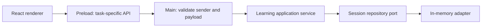

# Electron learning application: research and decision brief

- Researched: 2026-10-04
- Scope: a small Windows, macOS, and Linux desktop learning workspace built with Electron, React, and a Node.js backend.
- Decision: TypeScript throughout; electron-vite for development/builds; electron-builder for packaging; a sandboxed renderer calling application services through a narrow preload API.

## Evidence and recommendations

| Question | Primary evidence | Project recommendation |
| --- | --- | --- |
| Where does the Node backend live? | Electron describes main, renderer, preload, and utility processes in its [process model](https://www.electronjs.org/docs/latest/tutorial/process-model). | Begin with small asynchronous-capable application services hosted by main. Keep Electron lifecycle separate from learning behavior. |
| What should we learn from VS Code? | The VS Code team describes its [sandbox migration](https://code.visualstudio.com/blogs/2022/11/28/vscode-sandbox), including preload APIs and offloading expensive work. | Adopt the privilege boundary and responsive workbench idea. A learning app does not yet need an extension host, Monaco editor, or VS Code's internal framework. React is our independent UI choice. |
| How should the UI reach the backend? | Electron's [IPC guide](https://www.electronjs.org/docs/latest/tutorial/ipc) demonstrates request/response calls through preload. | Expose task-specific functions, shared DTOs, and predictable result envelopes. Avoid a local HTTP server until another client actually needs it. |
| What security belongs in the foundation? | Electron's [security recommendations](https://www.electronjs.org/docs/latest/tutorial/security) cover sandboxing, context isolation, sender verification, navigation, CSP, and custom protocols. | Explicitly disable renderer Node integration, enable sandbox/isolation, check window/frame/origin, validate requests at runtime, deny new windows and browser permissions, and serve built assets through a constrained custom protocol. |
| Is TypeScript a normal choice? | React documents [TypeScript integration](https://react.dev/learn/typescript), and electron-vite documents [TypeScript configuration](https://electron-vite.org/guide/typescript). | Use strict TypeScript and distinct Node/browser compilation scopes. Run type checking separately from bundling. |
| How should source files be organized? | electron-vite recommends [main/preload/renderer entry points](https://electron-vite.org/guide/dev). | Retain `src/main`, `src/preload`, and `src/renderer`; add small `src/core` and `src/shared` boundaries for domain behavior and transport contracts. These additions are project design choices. |
| Which build approach fits? | [electron-vite](https://electron-vite.org/guide/) builds the different process targets. Forge also offers [Vite templates](https://www.electronforge.io/templates/vite), but its documentation currently labels Vite integration experimental. | Choose electron-vite plus electron-builder. Forge remains a credible alternative; Forge/Webpack is appropriate if official integrated tooling outweighs the Vite workflow. This is a fit decision, not a universal ranking. |
| Can preload be ESM? | Electron's [ESM documentation](https://www.electronjs.org/docs/latest/tutorial/esm) explains that sandboxed preloads do not use native ESM imports. electron-vite explains [dependency bundling](https://electron-vite.org/guide/dependency-handling). | Write TypeScript imports, then bundle preload to one CommonJS `.cjs` file, externalizing only Electron. Do not disable sandbox to make imports work. Main and renderer can use ESM. |
| How do we preserve responsiveness? | Electron's [performance guidance](https://www.electronjs.org/docs/latest/tutorial/performance) recommends measurement and avoiding main-thread blocking. | Keep this tiny fixture service in main. Move document parsing, indexing, local inference, or CPU-intensive work to workers/utility processes when introduced; define cancellation, failure, and resource limits then. A utility process alone is not a sandbox for learner code. |
| How do we ship three platforms? | electron-builder's stable [multi-platform guide](https://www.electron.build/v26/docs/features/multi-platform-build/) explains host/native-module restrictions; Electron covers [signing and notarization](https://www.electronjs.org/docs/latest/tutorial/code-signing). | Configure NSIS, DMG, and AppImage targets; package/test on matching OS runners. Treat signed installers and real OS testing as release work, distinct from a source build or unsigned package. |
| Can we harden packaged binaries? | electron-builder supports [Electron fuses](https://www.electron.build/v26/docs/tutorials/adding-electron-fuses/). | Disable RunAsNode, Node options, CLI inspection, and extra file-protocol privileges in packaged builds; enable ASAR-only loading and integrity validation. Development Electron retains inspection for smoke tests. |
| How can we verify the actual app? | Playwright documents its [experimental Electron automation API](https://playwright.dev/docs/api/class-electron). | Use focused domain/security unit tests plus a real Electron smoke journey covering preload, IPC, session creation, and practice feedback. Keep experimental automation isolated from application code. |
| What does “like Cowork” mean here? | Anthropic's [Cowork guide](https://support.claude.com/en/articles/13345190-get-started-with-claude-cowork) describes a task workspace and explicitly granted context. | Borrow the calm sidebar/workspace/context arrangement. Center it on learning goals and practice. This skeleton does not claim AI tutoring, file access, autonomous actions, or Cowork's execution architecture. |

## Selected architecture

Core has no React, Electron, Node, or filesystem imports. Shared contracts contain serializable DTOs, request parsers, channel names, and result envelopes. Main owns composition, OS lifecycle, protocol serving, and IPC registration. Preload exposes a small capability surface. Renderer owns display, drafts, navigation, and request states.

The backend is a Node runtime inside Electron, so users do not need to install Node. The development host needs Node and npm. No separate Express process, open backend port, Python runtime, or remote service is necessary for this first slice.

## Toolchain compatibility

Registry metadata was checked live before installation. electron-vite 5 supports Vite 5–7, while the latest Vite and React plugin target a newer major. The scaffold deliberately uses Vite 7 and React plugin 5. Similarly, TypeScript 6 stays within typescript-eslint's declared peer range rather than selecting TypeScript 7 just because it is newer. Exact installed versions are recorded in `package-lock.json`; future upgrades must check peer ranges and run the gates.

## Local documentation convention

Context Bank discovery was read-only. The root `INDEX.md`, `03-capability-context/INDEX.md`, `03-capability-context/skills/INDEX.md`, and canonical `03-capability-context/skills/adr/SKILL.md` establish the project's familiar documentation style: `ref/patterns.md`, focused `ref/patterns-<area>.md`, and numbered `ref/ADRs/ADR-000X-<slug>.md` records with Status, Date, Context, Decision, and Consequences. Patterns state current rules; ADRs explain rationale. Add `ref/ADRs/INDEX.md` to make selection explicit.

These conventions govern documentation, not the application source layout. Source organization above follows the Electron build boundaries. Context Bank log-write warnings were separate from successful content reads; no bank content was changed.

## Smallest useful implementation

Initial skeleton visual thesis: a warm neutral workspace with generous central spacing, quiet side panels, and one terracotta action color. Content plan: course navigation, a goal composer, a reading/practice session, and contextual guidance. Interaction thesis: a short workspace entrance, clear hover/focus transitions, and a brief feedback reveal; respect reduced motion. This records the first implemented appearance. The later [Codex UI research](codex-desktop-ui.md) and [ADR-0007](../ADRs/ADR-0007-codex-inspired-design-and-ux.md) establish the adopted direction for future UI changes.

1. Display three static demo courses in a workbench shell.
2. Start a goal-labelled session through real preload/IPC/Node services.
3. Answer one fixture question and receive deterministic feedback.
4. Navigate between sessions while the process lives.
5. Provide build/packaging commands, progressive pattern/ADR discovery, and meaningful verification.

## Deliberate next decisions

- **Persistence:** currently in memory and explicitly disclosed. Choose storage through the repository port after defining content sizes, migration, recovery, and privacy requirements. SQLite is a candidate, not an accepted dependency.
- **AI tutoring:** decide cloud versus local inference, consent, provider ownership, streaming/cancellation, and evaluation before adding a provider adapter. Keep credentials and provider calls out of renderer.
- **Imported material:** design explicit scoped file access and untrusted-content handling before enabling it. Learner/model text remains plain React text in this slice.
- **Learning outcomes:** fixture completion is not evidence of mastery. Product research must define retrieval practice, retention, assessment, and learner adaptation separately.
- **Release:** final app identity/icons, signing credentials, notarization, update channels, installer smoke tests, and architecture coverage remain release work. No automatic updates or publishing are enabled.

## Validation plan

Run lint, both TypeScript scopes, focused core/contract/protocol tests, and production bundles. Exercise the built application with Electron automation, inspect a screenshot, and package an unsigned Linux directory locally when supported. A native OS CI matrix checks source and package compilation on Windows/macOS/Linux; it does not substitute for signed installer acceptance on user machines. Record actual results in `validation.md` beside this brief.
