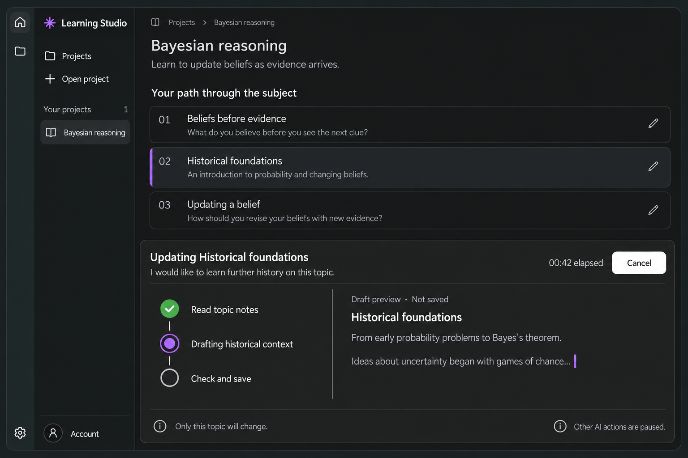

# Spec: Shared Pi Streaming and Generation Panel

Status: Ready for implementation
Date: 2026-10-05
Source: User request to keep receiving streams alive, implement the locked generation panel for every AI call, and establish this approach for future AI work.
Goal: Every explicitly started AI call has visible, honest streaming feedback and cancellation; incoming stream data prevents elapsed-time cancellation; other AI calls remain unavailable until the operation settles.

## Summary

Introduce one application-wide AI operation lifecycle, using Pi in the existing utility-process boundary. Migrate outline creation, whole-outline rewrites, topic rewrites and both model-access diagnostics onto it. Replace absolute inference deadlines with resettable network-inactivity detection. Render all operations through the approved bottom panel, with connected activity icons, elapsed time, Cancel and a developing preview. Establish the same transport, ownership and presentation contract in contributor guidance for future AI features.

This spec authorizes planning only. Tickets, implementation, accepted ADR changes and runtime documentation updates are subsequent work. The selected design is already approved; working streaming and its validation are not yet implemented.

## Problem / Context

- [Pi outline generation](../../../src/main/generation/pi-outline-engine.ts) has a 180-second overall abort signal and SDK request timeout. The [main worker client](../../../src/main/generation/worker-client.ts) independently kills its operation after 190 seconds. Receiving useful output cannot extend the overall deadline.
- The reported October 5 topic edit received HTTP 200 promptly but failed after approximately three minutes without a completed stream. Existing diagnostics cannot establish whether body chunks were still arriving. This is evidence of the fixed deadline, not proof of a particular provider/network fault.
- [GenerationService](../../../src/core/generation/service.ts) publishes broad phases. The worker protocol carries phases/results/errors and diagnostic metadata, but no learner-facing stream preview. [App](../../../src/renderer/src/app/App.tsx) closes the editor on accepted submission, leaving [GenerationStatus](../../../src/renderer/src/features/projects/GenerationStatus.tsx) as a small row above the outline.
- [Model access tests](../../../src/main/auth/model-access-test.ts) are a second inference path: direct main-process HTTP/SSE, a 30-second absolute deadline, independent cancellation and per-connection verification. They must be included in “all AI calls”. OAuth, credential renewal, model discovery and revocation do not generate model output and are outside that phrase.
- Installed `@earendil-works/pi-agent-core` and `@earendil-works/pi-ai` are pinned to 1.0.2. Their local declarations expose `Agent.subscribe()`, `message_update` with text/tool-call deltas, and tool execution lifecycle events. The Responses adapter builds partially parsed tool arguments. The live `partial` object is mutable, so it is not itself an immutable IPC snapshot. Outline output is normally a structured `submit_outline` call; text-only streaming would be insufficient.
- [The selected design and handoff](../../../docs/design/component-designs/01-generation-streaming/generation-streaming-selection.md) govern the panel. Existing [milestone acceptance](../01-project-setup-and-outline/acceptance.md) and [topic validation](../../research/topic-edit-validation.md) describe earlier evidence, not acceptance of this change. Flow-reference tooling under ADR-0020 is present in the working tree and must be preserved.

Baseline inspection: existing modified/untracked files include flow-reference work and the approved design handoff. None is attributed to this spec or to the timeout without evidence. Only this new planning bundle is written during spec authoring.

## Goals

- Keep a receiving inference stream alive regardless of total elapsed time, while retaining recovery from silence, crashes and cancellation.
- Make work visible immediately, including the period before the first text or structured preview appears.
- Use the approved panel for every present inference entry point and require it for future ones.
- Preserve independent result validation, topic/file scope, account verification, draft ownership and storage-only retry.
- Keep transport liveness, task progress, validated output and saved work distinct.

## Non-goals (Strict)

- New tutoring, research, lesson delivery, background AI jobs, automatic retries, parallel AI calls or a call queue.
- New provider endpoints, login methods, ambient API keys, model substitutions or entitlement claims.
- Saving partial outputs, replaying interrupted provider streams, restoring an active stream after app restart, or persisting a stream transcript.
- A private-thinking viewer, raw JSON/tool log UI, percentage completion or predicted completion time.
- Removing response/turn/file limits, expanding project-file authority, binary authoring, shell execution or changing the existing publication transaction.
- A general UI redesign. The new panel must not introduce heavier boxed topic rows elsewhere merely because the reference image has them.

## Scope

### In scope

Outline creation, whole-outline rewriting, topic rewriting, explicit Sol/Luna access checks, shared global operation ownership, Pi streaming projection, inactivity policy, bottom-panel presentation, safe diagnostics, documentation and integrated acceptance evidence.

### Out of scope

Non-inference account/network requests retain their current deadlines and UI. Future AI capabilities are governed by the new integration rule but are not built here. Cloud execution, off-device progress synchronization and OS notification systems are not added.

## Requirements (Functional)

| ID | Testable requirement | Verification path |
| --- | --- | --- |
| R01 | Every current inference entry point uses the shared AI coordinator, Pi-backed utility execution and progress contract. Migrate both fixed-target model tests as well as all three outline operations; remove their direct inference bypass. | Source inventory; Pi/provider/account unit tests; model-access and outline/topic Electron journeys. |
| R02 | Main-owned operation admission permits one AI operation across projects and account diagnostics. Claim before async authorization/preparation; reject competing requests as BUSY without starting a provider request. Same-target diagnostic duplicates reuse the owned operation. UI disabling is supplementary. | Coordinator race tests; malformed/competing IPC tests; desktop provider request counts. |
| R03 | No overall inference deadline expires a receiving stream, including across multiple Pi turns. Default network inactivity is 180 seconds since request start, the one transition into the body-wait stage, or the last nonempty received body chunk. Any nonempty chunk resets it, including SSE comments/heartbeats or fragments split before a complete event. Headers may begin the body wait once; merely remaining socket-open cannot extend it. | Fake-clock transport tests past 180/190 seconds and SDK defaults; one real >190-second desktop stream. |
| R04 | A request that never receives body bytes, or an open stream that becomes silent, is aborted after the inactivity interval with a safe retryable NETWORK error. Each provider turn starts its own wait; leaving a stream for a local tool disarms the network timer. No automatic retry consumes allowance. | Silent-header, stalled body, chunk-boundary and multi-turn tests; recovery journey. |
| R05 | Remove the worker's fixed elapsed watchdog. Detect spawn failure, worker exit and a genuinely unresponsive worker separately. Local process heartbeats cannot reset provider inactivity or fabricate task progress. Cleanup releases admission exactly once. | Worker lifecycle unit/integration tests; responsive idle worker versus dead worker cases. |
| R06 | Keep existing turn, request/response, outline and project-file bounds. Bounds apply during streaming even when heartbeats continue. Explicit byte/turn/validation failures retain their own recovery classification and are not misreported as timeouts. | Existing boundary tests plus active-stream limit cases. |
| R07 | Publish actual task activity, text deltas where useful, and structured draft projections from Pi events. Show a waiting state before output. Provider bytes count for liveness without being advertised as completed work; no private-thinking text or raw tool arguments/results reach the UI. | Projection/worker schema tests; text-only, structured-only and heartbeat-only fixtures. |
| R08 | Render partially available outline/topic fields as readable provisional content. Missing/incomplete fields are tolerated by a dedicated preview schema, never the accepted-outline parser. Repairs replace the prior candidate by revision, rather than appending duplicate outlines. Preview truncation must not truncate accepted output. | Partial JSON, replacement/repair, malformed-content and large-output projection tests. |
| R09 | Correlate every update to operation, project/topic when applicable, provider turn and preview revision. Ignore late, duplicate or older updates after cancellation/new runs. A topic preview exposes only the selected stable topic, even if the model proposes unrelated changes. | Coordinator/project ownership and adversarial topic tests; desktop cancellation followed by a new run. |
| R10 | Preview text, complete-looking arguments or HTTP 200 never establish completion. Keep completed-stream, independent outline/source validation and topic/file authorization before publication. Missing/incomplete/failed/aborted streams preserve prior outline/files. | Existing terminal-acceptance tests and streamed partial-result tests; file byte assertions. |
| R11 | Activity state appears upon accepted submission. Forward live preview snapshots at most 10 times/second, with a latest-update delay of at most 250 ms under the reference fixture. Lifecycle and terminal transitions are immediate and cannot be dropped by preview coalescing. | Injected-clock batching tests; renderer event ordering; burst fixture. |
| R12 | Implement the locked bottom split panel inside the main workspace, with connected vertical activity icons at left and a wider preview at right. Keep the navigation rail/sidebar unobstructed. Header contains operation/request, elapsed time and supported Cancel; footer contains accurate scope and “Other AI actions are paused.” | Actual Electron captures against approved reference, Light/Dark and narrow/zoomed review. |
| R13 | Use the same panel for initial outlines, whole-outline/topic edits and account-scoped model tests, including tests from the dashboard with no open project. Titles, scope and activity must match the operation. A model test sends/reads no project data and shows status evidence rather than raw reply text. | All producer desktop journeys; diagnostic worker input and privacy assertions. |
| R14 | Submission transitions an edit/account overlay into the visible workbench panel immediately after acceptance, preserves its draft, and maintains useful focus. Do not wait for inference completion to dismiss a covering overlay or leave progress hidden above the scroll position. Rejected submission stays with its input and error. | Keyboard/IME, submission/acceptance and no-project model-test journeys. |
| R15 | Preserve fixed diagnostic targets, explicit allowance disclosure, model identity matching, completed status and nonempty streamed/final text evidence. Verification remains independent per model and per connection session. A model mismatch or error after apparent completion cannot verify access. | Migrated model-access/provider/account tests and independent Sol/Luna desktop assertions. |
| R16 | Cancel aborts the owned worker/network request and settles before another AI call can start. Keep cancellation available through inference/validation; once publication begins, wait for saving. Closing a settings panel or ordinary disclosure never silently cancels a call. | Active-stream cancellation and terminal races; saving cancellation guard tests. |
| R17 | Keep authoritative unsaved output and staged edits for storage-only retry. Failed inference/cancellation retains previous saved work and the relevant user draft. Confirmed topic save conflicts preserve unrelated latest content and file baselines. | Generation/storage/topic unit tests and recovery desktop byte assertions; provider request counts on retry. |
| R18 | Publish success only after domain acceptance: backend-confirmed save for outlines, completed identity-checked response for model tests. Release global AI ownership on settled outcomes; keep failure/recovery visible. A retained terminal preview is not an active call. | Terminal-state/lease tests; verified-versus-saved desktop assertions. |
| R19 | Support both themes, minimum supported window, 200% zoom, long titles/requests, keyboard focus, reduced motion and selectable preview content. Announce meaningful activity transitions politely, not every character. Never convey state solely by dimming/color. | Flow screenshots, keyboard tests and manual screen-reader/contrast review. |
| R20 | Preserve saved-content reading and user reading position while streaming. Navigation during project inference retains Stay here / Cancel and switch. Account tests have no project owner and survive dashboard/project view changes with the global panel still discoverable. | Navigation/scroll and account-scoped dashboard journeys. |
| R21 | Diagnostics record bounded safe liveness counters and terminal reasons sufficient to distinguish receiving, silent and unresponsive states. No content, paths, tokens, identity, provider messages or tool data enters logs. Logging failure cannot change results. | Diagnostic allowlist tests with secret/content sentinels; inference-diagnostics journey. |
| R22 | Document the mandatory shared Pi admission/streaming/panel contract, inactivity semantics and future producer integration recipe through a new ADR, indexes and focused patterns. Retire superseded fixed-deadline/direct-diagnostic rules explicitly, preserving historical evidence. | Documentation requirement checklist; resolved links; source inventory against future integration rule. |
| R23 | Register/refresh passing Playwright progress checkpoints and maintain flow narratives under ADR-0020. Keep design references distinct from actual captures. Record exact integrated commands, limits and live/platform gates in this bundle. | `npm run test:flows`, reviewed flow captures, implementation validation/acceptance records. |

## Requirements (Non-functional)

- **Performance:** network liveness bookkeeping is independent of React and progress subscriptions. A slow subscriber cannot stall body consumption. Pi subscription callbacks only project/enqueue bounded state; no awaited renderer work. Default limits: 64 KiB UTF-8 of preview text plus at most 40 activity entries, each with a 256-character label; serialized progress frames at most 96 KiB. Maintain a cumulative count for omitted history and an explicit abbreviated-preview flag. Do not retransmit every saved project/result with each token.
- **Reliability:** injected monotonic time supports deterministic testing. Clear timers/readers/subscriptions on every terminal path. A late canceled worker cannot revive a settled operation or update its project. A receiving stream may last indefinitely in time, within unchanged byte/turn budgets; the user retains Cancel.
- **Security/privacy:** no Node/Electron/core imports in renderer, no generic inference/fs/IPC capability, and no credential/content logging. Render provisional model data as text. Neither preview schema tolerance nor partial argument parsing weakens acceptance validation.
- **Observability:** separate last received-byte age, last semantic-update age and worker health. Publish coarse UI waiting/receiving state without invented progress. Log aggregate counters/coalesced transitions at most once/second, with terminal summaries immediate; preserve ADR-0018 queue and disk limits.

## Proposed Solution

### Ownership and data flow

| Layer | Responsibility |
| --- | --- |
| `src/core` | New platform-independent AI operation coordinator/ports: global lease, operation identity, lifecycle, sanitized progress state, immutable snapshots and stale-update rejection. GenerationService retains outline acceptance/save recovery. AccountService's existing main-owned credential/session responsibilities remain outside core. |
| `src/shared` | Serializable discriminated operation/progress DTOs, preview-only schemas, limits and strict cancellation parsing. No privileged imports or tokens. |
| `src/main` | Composition, sender authorization, credential/model resolution, sanctioned task profiles, private worker port, transport/worker health policy, account verification and safe diagnostics. All inference routes through the same Pi worker adapter. |
| `src/preload` | Named activity read/subscription/cancellation methods and existing named outline/model-test starts. No arbitrary task, URL, prompt, model-test target or tool registration exposed. |
| `src/renderer` | Global activity subscription, selected bottom panel, input-to-progress transition, readable preview, elapsed display, action availability and focus/scroll behavior. |

Use the coordinator as the single source of active AI ownership. Claim its lease synchronously before authorization/preparation can yield. Give the owning domain task a private lease handle, including cancellation and progress callbacks. Completion of inference alone does not release an outline task while its publication is still pending. Release on saved, unsaved, needs-details, failed, cancelled or verified model-test settlement.

Remove the distributed `inferenceBusy`/test booleans as competing admission authorities; account/generation snapshots can retain their feature-specific presentation states. Internal credential renewal for the lease owner must remain permitted. Starting another inference, reconnecting, signing out or changing the connection must not interleave. Do not create a guard cycle where the owner is denied its own authorization because it has already claimed the global lease.

### Pi task profiles

- **Outline profile:** retains the existing educational prompt, material/project tools, 16-turn ceiling, request whitelist, 8 MiB per-response cap, 4 MiB request cap, validated outline and independent topic localization. Reuse `pi-outline-engine.ts` after extracting shared transport/lifecycle facilities.
- **Model-access profile:** one fixed, tool-free Pi response turn using the selected named Sol/Luna diagnostic target and the existing fixed short reply intent. No project path, brief, outline, file tools or stored credentials in its worker input. Preserve the 256 KiB response cap and independent raw protocol/model evidence needed by the verifier. Remove direct `testModelAccess` fetch/SSE execution; retain/refactor its safe verification and summary logic. Use the Pi stream with `onProviderStreamEvent` privately to collect terminal/model/text-evidence metadata, not to send raw events to React.
- **Future profiles:** must declare kind, model resolution, data/tool scope, acceptance rules and preview policy; run through the same coordinator/Pi adapter/panel. Adding a profile does not authorize arbitrary tools or automatic/background inference.

All profiles keep explicit delegated tokens, sanctioned endpoint checks, redirects disabled, `store: false`, streaming and zero automatic provider retries. Keep pinned SDK versions unless compatibility work proves a necessary version change.

### Liveness policy

Replace total elapsed cancellation with an inactivity controller owned by the shared transport. Start a 180-second wait when a provider request starts. Reset on response headers once to begin the body wait, and thereafter on every **nonempty body chunk** observed before SSE parsing; headers alone cannot keep extending the wait. A real SSE comment/heartbeat counts as received data. Empty chunks, React renders, local worker heartbeats and synthetic activity messages do not. Apply this policy to both outline and model-test inference.

There is no cumulative network/runtime deadline over a healthy response or multi-turn job. Every new provider turn begins a fresh inactivity interval; successful tool execution is a local phase, not a silent provider stream. Show elapsed time as observation, not a countdown. After 30 seconds without body bytes while waiting/receiving, show “Waiting for the next update…” and retain Cancel; this is a nonterminal explanation. Fail only on 180 seconds of network inactivity, cancellation, a real transport/worker failure, existing size/turn limits or invalid output.

Audit each layer: outline-wide AbortSignal, worker `setTimeout`, model-test AbortSignal, Pi/OpenAI request settings, custom fetch and native connection/header/body inactivity defaults. Removing the outer 180-second signal alone is insufficient. The installed OpenAI client uses a finite timeout while awaiting headers and clears that timer when fetch returns; preserve bounded pre-stream connection waiting, but ensure no SDK/adapter deadline survives as a total receiving-stream timer. Do not misuse `timeoutMs: 0` without confirming its semantics. No Node maximum-timer overflow or enormous-total-time workaround.

Use a 30-second worker-spawn deadline and a separate worker responsiveness channel (5-second heartbeat, 30-second silence threshold). Start responsiveness monitoring after spawn. The worker sends liveness only while its event loop is responsive; main validates monotonic sequence and phase. Provider-byte activity carries a separate coalesced counter/age. A responsive worker waiting on a silent provider still expires under the provider-inactivity policy. No fixed main elapsed timer overrides an active stream. Preserve bounded existing file operations; a local operation that genuinely stops responding is handled by worker health, not mislabeled provider silence.

### Projection and bounded delivery

Subscribe to Pi before starting the prompt. Map actual request/response and tool lifecycle into learner labels. A started tool is not a successful read; only its successful outcome can mark “Read topic notes” completed. Rejected arguments display repair/checking activity, not a green success. When no file read occurs, omit that step rather than presenting a fictional completed read.

Project assistant text as bounded plain text where it is useful. For `submit_outline` partial arguments, read the SDK's partially parsed content at a coalesced update boundary and copy only safe display fields. Do not copy the mutable Pi object or the full agent transcript. Whole-outline previews can include heading/overview, topic headings/objectives and module prose as available. Topic previews select only the requested lesson ID; before that ID is available, show “Preparing this topic…” instead of guessing by index or exposing another lesson.

Candidate identity includes provider turn/tool-call identity and a preview revision. A correction supersedes the previous candidate. Partial/malformed/truncated fields can be absent without breaking the renderer. Cap preview independently from full-result validation. Do not echo file contents from read tools or file baselines; file-write activity can say “Preparing topic material” without presenting raw write payloads. Model tests show “Receiving test response…” and evidence such as “Reply received; checking model access”, retaining only boolean/count evidence, never reply text.

Coalesce latest previews at 100 ms intervals; enforce R11's delay and frame limits. Emit start, semantic phase transitions, errors and terminal state promptly. Drain pending projection before the final domain state, or deliberately discard it with the terminal revision so it cannot arrive afterward. A UI/projection failure must not alter result acceptance; inability to validate a worker protocol frame fails safely and never grants extra authority.

## Interfaces / APIs / Contracts

Concrete names may follow existing conventions; these semantics are required:

- `AiOperationKind`: `create-outline`, `rewrite-outline`, `rewrite-topic`, `test-sol`, `test-luna`.
- `AiOperation`: generated operation ID; optional owning generation run/project/topic IDs; authorized model display identity; safe heading/request summary; lifecycle phase; monotonic elapsed and last-byte-age counters; ordered bounded activity entries; cancel availability; preview kind/revision/abbreviation; safe error/outcome. No access tokens, source contents or arbitrary provider fields.
- `AiPreview`: discriminated `none`, `text`, `outline`, `topic` or `model-test-evidence`. Partial outline/topic projections are different types from `LearningOutline`/`SavedOutline`; they cannot be passed to persistence.
- `AiActivitySnapshot`: revision, active operation and latest settled presentation. Keep large accepted results/recoverable edits in their existing domain owner, not in every streaming frame. A pending unsaved outline can be re-presented from GenerationService when returning to its project.
- Named preload API: `getAiActivity()`, `onAiActivityChanged(listener)` with unsubscribe, and `cancelAiOperation({ operationId })`. Runtime cancellation validates ID and sender then delegates to the owned task; stale IDs fail safely. Existing domain-specific cancellation methods can remain compatibility wrappers over the same owner.
- Keep existing named outline creation/rewrite and fixed diagnostic start methods. Change model-test submission to return its initial testing snapshot after accepted admission, as outline submission already does; account/activity events deliver later outcome. Update callers/tests that currently await verification in the start reply. Do not expose a generic `executeAi` API.
- Worker progress/transport/health messages have explicit discriminants, monotonic sequence and size checks before main forwards them. Main binds correlation and task scope from its launch context, not from renderer/provider text. Diagnostic model evidence and tokens remain private.
- Late initial queries cannot overwrite newer event revisions. No public runtime/test timeout knobs permit bypassing policy. Tests can inject private clocks/options into adapters.

## Data Model / Storage

No `.edu`, credential or recent-project format migration. Activity/preview state is session-memory only and is cleared or replaced after its owning task/terminal presentation is dismissed. On app exit, abort/terminate owned inference; reopening shows saved project state rather than inventing resumed activity.

Preserve canonical `.edu/project.json`, topic `.edu/topic.json`, staged edit baselines and `.edu/file-transaction.json` recovery under ADR-0019. Raw partial drafts never enter these files. Keep full generated-but-unsaved results privately for storage-only retry. Account verification remains connection-session evidence, resets on reconnect/sign-out/restart, and does not persist an entitlement.

## Auth / Authorization

Use current owning-window/main-frame/origin/entry checks and strict payload parsers for every new capability. Main resolves authorized models, project ownership and task scope. Tokens travel only over the private utility port; worker environment remains deliberately restricted. Diagnostic requests remain fixed-target/no-input and cannot select arbitrary models, destinations or tools. Browsing saved content remains possible without inference access.

## UX / Workflows

### Approved reference

The image is the locked single-window reference, unchanged from the user's approved revision. Use its bottom split panel and connected icons; it is a concept, not a working-flow screenshot. Preserve current outline row styling and theme tokens outside the panel.

### Submission and running

1. Learner starts one explicit operation from project setup, an editor or account settings. Validate locally and in main. If admission fails, preserve the input surface and explain the error there.
2. On admission, show the panel immediately in the main workspace. Transition a covering edit/account dialog away; focus the panel heading once for this explicit context transition, without stealing focus for later updates. Persist the relevant in-memory draft.
3. Keep a readable saved document or dashboard above the dock. The dock belongs to the workbench layout, not a card deep in its scrolling document: it remains visible while the saved document is scrolled. Give the saved document and long preview independent scroll regions within the main workspace. The panel begins near the reference's lower 40–45% of workspace height; adapt rather than hardcode pixel dimensions.
4. Header names operation and affected topic/model, displays request summary where applicable, measured elapsed time and Cancel. Timeline steps have connected icons and text state. Right-hand preview is labeled “Draft preview · Not saved” for educational output. Scope footer names only the current operation's actual authority; every active call shows “Other AI actions are paused.”
5. Other inference buttons and submission shortcuts are disabled/guarded application-wide. Saved reading, disclosures and appearance settings remain usable. A reopened account/settings overlay can be dismissed without cancelling; do not add an automatic queue or silent restart.
6. At narrow sizes, stack timeline and preview within the dock. Respect the existing responsive navigation drawer/bottom rail. Ensure neither Cancel nor the running indicator moves outside the viewport. Preserve manual scroll position while text grows; auto-follow only while the reader remains at the preview's end.

### Settlement and recovery

| Outcome | Required presentation |
| --- | --- |
| Waiting/no draft | Actual waiting/current activity and elapsed time; no fabricated text or completed step. |
| Checking | Draft remains provisional while validation/repairs proceed. |
| Saving | Show saving distinctly; cancellation unavailable only after publication begins. |
| Saved outline / verified test | Show the correct domain confirmation; release active AI restriction; terminal panel can be dismissed explicitly. |
| Needs details | Preserve prior work/draft, present the essential question and route back to the owning input. No staged file publication. |
| Cancelled / inference failure | Keep previous saved work and user draft; label any retained partial preview as incomplete, never saveable. Provide the existing explicit retry route. |
| Unsaved result | Display the validated unsaved result and storage-only Retry save or Review save conflict; preserve existing identity/baseline checks. |

A storage retry is not an AI call. It still observes existing project/save guards and publication cancellation limits. Preserve an unsaved result when another allowed diagnostic/project call is later made; the single global panel cannot be its only storage owner. Never force a new inference just to retrieve or save it.

## Work Breakdown (Ticket Seed)

1. **Shared lifecycle and contracts:** define coordinator/lease, operation/preview schemas, revisions, bounded buffering and named bridge methods with race/security tests.
2. **Transport and worker health:** extract shared Pi request/stream adapter; add byte-observed inactivity and independent worker health; remove fixed overall timers; test multi-turn lifetime, cleanup and response bounds.
3. **Domain adapters:** connect outline generation and private preview projection; migrate both fixed diagnostic profiles into the same worker path; preserve result/verification rules and model-test start semantics.
4. **Panel and workflows:** implement the locked bottom component, global subscription, all entry-point transitions, admission disabling, cancellation, scrolling, focus, theme and terminal recovery.
5. **Integrated acceptance:** add a streaming journey, update existing outline/topic/model-access/recovery journeys, perform long-stream and burst tests, refresh/review flow references.
6. **Durable guidance and evidence:** author the next ADR and update the constrained documents below; record final commands, acceptance coverage and external limits after integrated checks.

Steps 2/3 depend on the contracts in step 1; the panel depends on stable projected state; final integration/documentation must describe the resulting implementation. These are seeds, not generated tickets.

## Documentation and Decision Work

Implement R22 with the next available ADR, currently **ADR-0021: Shared Pi streaming lifecycle and generation presentation**. Recheck numbering before authoring. Explicitly amend ADR-0010's fixed elapsed-time bounds and ADR-0015/ADR-0016's direct-main diagnostic transport/30-second inference deadline. Preserve their endpoint, token, verification and serialization intent. ADR-0012/ADR-0019 cancellation, save-conflict and project publication guarantees continue to apply. ADR-0018 continues to prohibit content logging.

Update both indexes and these narrowly scoped owners during implementation:

| Document | Required maintained rule |
| --- | --- |
| `AGENTS.md` | Add an AI-work route to `ref/patterns-ai.md`; require all future inference to use the same coordinator/Pi/panel. |
| New `ref/patterns-ai.md` | Canonical producer recipe, operation admission, task-profile authority, liveness semantics, bounded previews, cancellation/settlement and links to the UI/security owners. Separate current implemented rules from future capability proposals. |
| `README.md` | Describe actual streaming UI, one-call restriction, Cancel, inactivity versus total duration, model-test migration and safe troubleshooting. |
| `ref/patterns-architecture.md` | Core lease/ports, main credentials/admission, Pi utility profiles and domain result ownership. |
| `ref/patterns-ipc-security.md` | Named activity APIs, private token/model evidence, preview projection/bounds and validated worker frames. |
| `ref/patterns-learning-data.md` | Provisional versus accepted/saved state, topic locality, unsaved recovery and independent model-test proof. |
| `ref/patterns-design-system.md` | Locked bottom panel, connected activity icon states, existing token use and theme/adaptation rules. |
| `ref/patterns-ux.md` | All inference entry points use the visible panel, actual activity, global AI restriction, waiting, cancellation and recovery. |
| `ref/patterns-renderer.md` | Typed global subscription, stale revisions, batching, safe partial rendering, focus/scroll and no privileged inference. |
| `ref/patterns-development-testing.md` | Long-stream/inactivity/health evidence, aggregate safe diagnostics and integration checks. |
| `ref/patterns-flow.md`, relevant `ref/flows/*/index.md`, `tests/flows/catalog.ts` | New/updated streaming checkpoints and actual journey explanations/capture ownership. |
| `ref/ADRs/INDEX.md`, `ref/patterns.md` | Add the new decision and discovery routes; explicit scoped supersession notes on affected ADRs. |
| `docs/overview.md` / PRD 01 | Link implemented progress behavior and mark the extension without rewriting historical requirements/evidence or claiming new teaching features. |

Keep the design handoff as the approved reference, not as runtime acceptance. Add implementation links when actual evidence exists; do not replace historical research with speculative claims. Spec authoring does not modify maintained rules to pretend the new approach already exists.

Future producer recipe must be explicit: add a sanctioned task profile/acceptance adapter, obtain the shared lease, authorize in main, use Pi streaming/liveness, provide bounded activity/preview projections, use the workbench panel, implement cancellation/domain settlement, and add process/bridge/security/visual evidence. A new direct provider fetch path or separate progress-only modal requires an explicit durable decision instead of bypassing the rule.

## Testing Plan

### Focused unit and protocol coverage

- Add coordinator/preview/liveness tests under `tests/unit`; extend `pi-outline-engine.test.ts`, `generation-service.test.ts`, `model-access-test.test.ts`, `account-service.test.ts`, `chatgpt-provider.test.ts`, `topic-edit.test.ts`, `capability.test.ts` and diagnostic tests where responsibilities move. Replace absolute-time assertions with inactivity assertions.
- With an injected monotonic clock: receiving chunks past 180/190 seconds and ten-minute SDK defaults succeeds; comments and incomplete-frame chunks reset idle; headers once/empty chunks/local heartbeats do not; silence aborts; a new turn gets a fresh interval; cancellation clears all timers. Check health independently from transport data.
- Test a structured-only outline that never streams ordinary prose, multiple repair candidates, cross-topic malicious proposals, byte limits during receiving streams, coalescing/final-frame order, slow subscriber isolation and bounded previews/history.
- Test model verification with text only in deltas, final-only text, empty output, wrong model, incomplete/missing completion, error after completion, cancellation and independent badges. Assert no project data/tools reaches diagnostic workers and no raw reply enters public state/logs.
- Test simultaneous starts before authorization resolves, opposite-domain contention, duplicate same-target probes, stale cancellation, lease release after all failure branches, unsaved result preservation and storage retry consuming zero provider calls.

### Real Electron and visual evidence

- Add `tests/desktop/ai-streaming.spec.ts` with a registered `ai-streaming` flow and isolated signed local provider fixture. Include one **unaccelerated at-least-200-second stream**, delivering small chunks/SSE heartbeats within the default idle interval, then a valid completed result. Assert the panel/Cancel remains available past 190 seconds and the final save succeeds. Give only this slow journey a justified test timeout (e.g. 300 seconds); do not widen every test's existing 45-second limit.
- Make the model-access fixture continue streaming beyond its old 30-second deadline before successful completion. Verify the shared panel from the dashboard, independent model evidence and reciprocal blocking with educational calls.
- Extend existing `outline.spec.ts`, `outline-edit.spec.ts`, `topic-edit.spec.ts`, `model-test.spec.ts`, `recovery.spec.ts` and relevant logging/appearance/reading checks. Cover visible accepted-start transitions, Cancel, idle recovery, forged/stale IPC, save failure/conflict and no source publication on partial failure.
- Capture actual waiting, running structured draft, checking/saving, unsaved/recovery and terminal states, plus Light/Dark, narrow/200% zoom, long request text and reduced motion. Use `tests/flows/fixture.ts` and cataloged checkpoints after behavioral assertions. The approved image is the design target, not a pixel snapshot baseline. Review captures and update each affected flow narrative after a passing refresh.
- Review focus/scroll preservation and representative screen-reader announcements manually. Node/React simulation is not equivalent to actual Electron process/bridge evidence.

### Gates and evidence

Run focused tests during implementation, then `npm run check`, `npm run test:desktop` and `npm run test:flows` with the configured flow reporter. Use PowerShell on Windows; only headless Linux uses `xvfb-run -a`. Do not run overlapping capture commands in one checkout. Because worker transport/profiles change, also run `npm run package` and `npm run test:packaged` on the implementation host, reporting unavailable native/package gates honestly. Do not weaken sandboxing or acceptance rules to make tests pass.

Create this bundle's `validation.md` during implementation with exact commands/results, code revision and environment limits. Add `acceptance.md` mapping R01–R23 to actual evidence, design review and remaining external gates. Refreshes from failed/skipped/interrupted journeys are not new evidence.

External qualification: explicit live-account streaming, late/slow real inference and Sol/Luna eligibility remain separate from fixtures. Perform only with user authorization to consume plan allowance; record what was actually observed. Do not deliberately manufacture an expensive live request merely to exceed three minutes. Native macOS/Linux appearance, suspend/resume and OS accessibility checks need their own evidence; Windows fixture success does not claim them.

## Acceptance Criteria

- [ ] Every inventoried inference path uses the shared coordinator and Pi utility profile; concurrent starts never issue a second provider request (R01–R02).
- [ ] Receiving streams and multi-turn jobs survive old elapsed cutoffs; genuine inactivity and worker loss settle safely; existing byte/turn caps remain enforced (R03–R06).
- [ ] Text/structured previews and truthful activity arrive promptly, remain bounded/provisional and cannot escape target-topic scope or update stale runs (R07–R11).
- [ ] All five operation kinds visibly use the approved bottom panel, including dashboard model tests, with correct context/acceptance transition and diagnostic privacy (R12–R15).
- [ ] Cancel, save, storage-only retry and confirmed conflicts retain prior guarantees; domain terminal states release ownership without losing recoverable output (R16–R18).
- [ ] Theme, keyboard, zoom, narrow layout, reduced motion, scroll and navigation are reviewed on actual captures/interactions (R19–R20).
- [ ] Safe diagnostic evidence distinguishes last received bytes, task progress and worker health without recording content (R21).
- [ ] The new ADR/indexes and focused rules make this route mandatory for future inference; passing flow references and bundle evidence describe the actual implementation and limits (R22–R23).

## Rollout / Migration Plan

No learner-data migration or staged feature flag is required. Integrate shared contracts/admission first, migrate all producers, then switch UI composition. Do not ship a mixed state where educational calls use the new lease/panel while diagnostic calls bypass it. Preserve named public starts and update their snapshot-driven consumers atomically. Existing in-memory runs need no upgrade compatibility across app restart; cancel them on shutdown.

Before release, audit production inference call sites and timeout composition, run the final integrated gates, update durable guidance, and verify packaged worker inclusion. A receiving stream's lifetime changes, so explain the new inactivity/cancellation semantics in README rather than promising guaranteed provider completion.

## Risks and Alternatives

- A provider may emit only heartbeats for a long time. They count as received data under the user's requested policy; show honest waiting, retain Cancel and enforce byte bounds. Do not invent semantic progress or impose a hidden total deadline.
- Mutable partial objects, out-of-order events and repaired outlines can produce misleading UI. Immutable bounded projections, candidate revisions and independent final acceptance address this.
- Migrating diagnostics to Pi changes transport and asynchronous submission semantics. Preserve identity/text evidence and account-session tests; do not infer verification from SDK model configuration alone.
- A dock can reduce reading space at high zoom. Responsive stacking, independent preview scrolling and reachable controls are required, not optional screenshot polish.
- Keeping recoverable output only in a global panel would lose it when another task begins. Domain owners retain authoritative unsaved results; the panel is a presentation consumer.
- Increasing the old absolute limit was considered and rejected: it still cancels receiving streams. Removing all silence/health detection was rejected because it strands users after failed connections. Text-only streaming was rejected because outline output is predominantly structured tool arguments. Leaving a direct-main diagnostic exception was rejected because “all AI calls” and future integration should have one route.

## Patterns and Standards Alignment

Follow [architecture](../../patterns-architecture.md), [IPC/security](../../patterns-ipc-security.md), [learning/data](../../patterns-learning-data.md), [design system](../../patterns-design-system.md), [UX](../../patterns-ux.md), [renderer](../../patterns-renderer.md), [development/testing](../../patterns-development-testing.md), [flows](../../patterns-flow.md) and [documentation](../../patterns-documentation.md).

Preserve ADR-0002 process security, ADR-0007/ADR-0013 appearance, ADR-0012 recovery, ADR-0017 rewrite provenance, ADR-0018 safe diagnostics, ADR-0019 topic/file publication and ADR-0020 flow references. The planned next ADR changes only the explicit deadline/diagnostic-transport decisions described above. This planning document does not silently supersede accepted rules.

Primary SDK references checked October 5, 2026: [Pi agent event guide](https://github.com/earendil-works/pi/tree/main/packages/agent#event-flow) and [Pi AI streaming guide](https://github.com/earendil-works/pi/tree/main/packages/ai). Local pinned 1.0.2 declarations/Responses source were inspected as the implementation evidence; current upstream documentation does not imply a dependency upgrade.

## Assumptions and Open Questions

- “All AI calls” includes explicit model-access probes and future model-output requests, not OAuth/discovery/revocation. The spec deliberately migrates the current probe bypass rather than leaving an undocumented exception.
- The approved one-call policy is app-wide. There is no implicit queue or parallel-project exception.
- “No timeout if the stream is open and things are coming in” means no absolute time cutoff while nonempty body data arrives within the inactivity interval. An open but silent socket remains recoverable. The 180-second idle, 30-second waiting hint and separate worker-health defaults are specified implementation choices, not provider promises.
- The existing storage/persistence and accepted educational semantics are preserved. Preview limits affect presentation only.
- **Material blockers: none.** The plan is ready for ticket authoring. Live account/platform evidence remains a qualification gate and must be recorded separately; no such call or code/desktop test ran during spec authoring.
