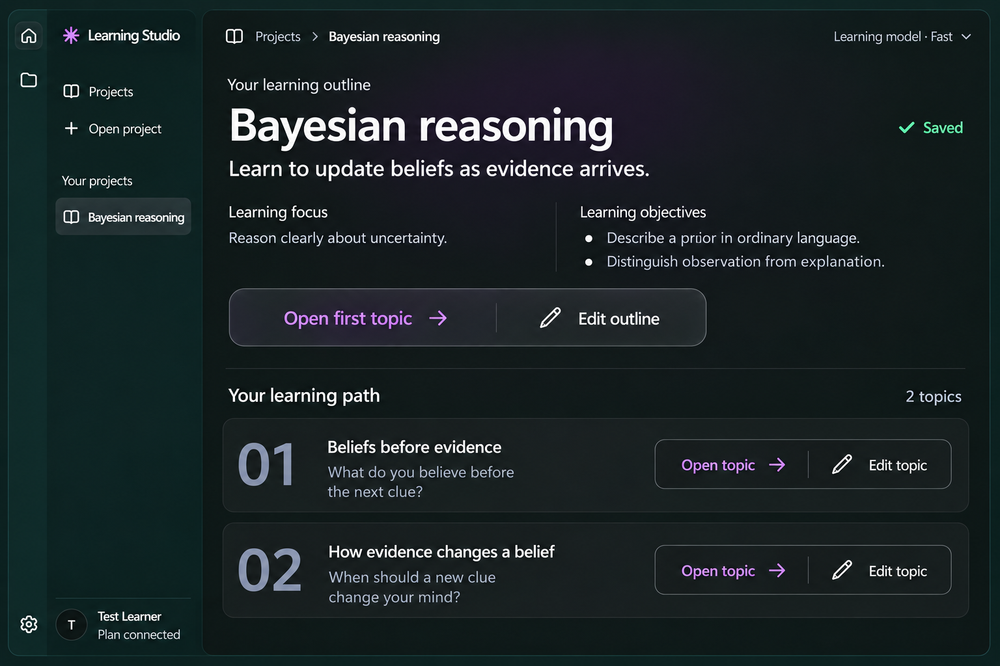

# Main-workspace design contract

Date: 2026-10-06
Updated: 2026-10-07 — selected logo added.
Status: Selected implementation target accompanying the [spec](main-workspace-design.spec.md); not yet the maintained application standard or proof of migrated runtime.
Selected direction: Sheet 04, option 5 — Quiet action groups.

## Reference and scope

The user locked the [selection](../../../docs/design/component-designs/02-project-overview/project-overview-selection.md), then clarified that this design applies to the **central main-window workspace and its present/future pages**. The rail, project sidebar/drawer, other side/detail panels and existing account/Settings panels retain their current design. The later selected-logo request permits only replacing existing brand glyphs, not changing those panels' layouts/styles. The reference's left navigation is contextual. Existing editor/confirmation dialogs and the approved AI dock retain their structures and behavior.

Adopt the following main-content vocabulary across pages: a strong subject/task heading, generous readable space, a barely perceptible lilac wash, neutral glass-like content groups and quiet labelled actions. Preserve each feature's actual task and data; a common look does not require every page to copy the overview's two-column layout.

## Region and stylesheet boundary

Place new workspace styles on an explicit central-content root and separately scoped contextual header. Do not attach the recipe to the document root, whole shell or studio-workspace ancestor that also contains the AI dock. Keep existing theme variables as shared baselines; add workspace-only semantic roles for the new surfaces, headings and actions.

Avoid global h1, button, .button.primary or surface palette changes that restyle excluded regions. Reusable workspace components consume scoped classes/tokens; sidebar/dialog/panel consumers continue their existing styles. If a feature later appears in both central content and a side panel, choose its region treatment explicitly rather than inheriting the main style by accident.

## Selected identity — Sculpted aperture

The user locked **logo sheet 02 option 4**, documented in the [logo handoff](../../../docs/design/component-designs/03-learning-studio-logo/learning-studio-logo-selection.md) with a [standalone reference](../../../docs/design/component-designs/03-learning-studio-logo/learning-studio-logo-final.png). Exactly three separate broad page shapes form an upright triangular contour/opening: two rising side pages and a shallow bottom page. Preserve the top/lower diagonal gaps and the taller triangular silhouette, rather than the sheet's rounder miniature wordmark.

Use one clean vector master for glyph-only in-app branding, theme-aware/monochrome treatments and native app-icon exports. The app tile uses restrained lilac on charcoal with a subtle rounded-square surface; production glyph fill is flat. Retain exact **Learning Studio** text, existing brand-slot size/control semantics and accessible names. Replacing that mark is the only exception to panel preservation; it is not permission to replace action/status icons, add brand slots or retheme panels.

R17–R18 in the spec require reproducible ICO/ICNS/PNG exports, actual small-size and package/native-host review, and canonical asset/clear-space/minimum-size/export documentation. The saved PNG is an approved visual reference, not a production vector or verified platform icon. No app identity/profile-path migration is implied.

## Reusable vocabulary

| Role | Rule and implementation starting point |
| --- | --- |
| Page/header | System sans-serif, sentence case, eyebrow + one main heading + readable supporting text; truthful status aligned nearby. Desktop heading approximately 36–44px / 1.15–1.25, weight 600; narrow approximately 26–32px. Wrap full titles; do not upscale chrome or panels. |
| Reading text | Existing 16px / 1.65 learning prose baseline; 14–16px controls, 12–13px nonessential metadata; readable contrast and complete text. |
| Workspace inset | Existing 4/8/12/16/24/32/48px spacing scale. Start at 32–40px main inset and 24–32px section gaps, decreasing to 16–24px when narrow. No fixed screenshot dimensions. |
| Content width | Overview/index may use available central width; prose/composer normally 680–760px. Keep long reading at a comfortable measure rather than spanning a huge window. |
| Context sections | Side-by-side at adequate width; stack when content/zoom requires. Light separation, no mandatory card around every paragraph. Full scope/outcomes remain reachable. |
| Glass-like surface | Neutral filled baseline with a soft highlight/low-contrast gradient and fine decorative edge, approximately 14–18px content-row radius. Subtle depth distinguishes an actionable object or real group. No dramatic blur or luminous borders. |
| Header illumination | A static, very faint lilac wash behind the main introduction; no gradient text, neon, moving glow or tint across all prose. Omit it where it harms readability. |
| Action group | One restrained rounded boundary around related independent commands, approximately 10–14px radius; inner spacing 12–16px, fine divider. At least 32px target height; 36–40px is a starting point. No tab/segmented-selection semantics. |
| Primary action | Muted accent text + navigation arrow on a quiet surface. One clear next action by label/placement, with neutral edit/support actions. Do not turn every action purple or require a filled purple CTA. Critical confirmation/error actions retain their existing explicit meanings. |
| Content row | Stable ordinal/icon, wrap-capable title/summary, separate action region. Space text and actions independently; a title can navigate but never encloses Edit topic. |
| Status/feedback | Existing success/warning/error tokens plus plain text/semantics. Saved means backend-confirmed publication; ordinals/counts are structural information, not progress. |

Sizes above are product starting values, not pixel measurements from the bitmap. Final values must be documented in canonical guidance after actual implementation review.

## Light/Dark and surface recipe

Use existing semantic Light/Dark base colors and state colors from the [design system](../../patterns-design-system.md). Proposed workspace-only roles include heading scale, header wash, content surface/highlight/border, group surface/divider, action text/hover and content radius. Exact names follow local conventions. Keep navigation/shell/dock tokens unchanged.

Dark: near-black canvas, neutral charcoal surfaces, pale primary text, grey supporting text, muted lilac navigation/action accent. Light: existing white canvas and pale neutral raised surfaces, darker readable text and existing darker purple accent; very faint cool/lilac highlight. A Light implementation must preserve the chosen hierarchy and quietness, not invert a Dark bitmap.

Provide an opaque baseline that works without backdrop-filter or OS transparency. Layered opaque gradients/highlights can deliver the glass appearance. Any optional translucency must have a documented fallback, measured contrast and bounded scope; avoid filters on repeated topic/module rows. Never blur content or dim the whole workspace just because AI is running.

## Controls and complete states

- Default: labels and icon meanings visible; main action identifiable through placement/accent. Pencil accompanies Edit; arrow means reading/navigation, not playback.
- Hover/pressed: modest local surface/border change; no large glow, scaling or layout shift. Hover is never the only route to an action.
- Keyboard focus: visible outline meeting essential-indicator contrast, including over group surfaces. Tab visits each command independently in reading order. Native editing/selection remains available.
- Disabled/pending: clear reason near relevant controls when useful; readable surrounding text. Preserve the group geometry and action labels; do not make the entire page inert when only AI starts are unavailable.
- Error/recovery: plain explanation + explicit next action in the same visual vocabulary. Keep validated unsaved output readable; storage-only retry stays distinct from a new AI call.
- Reduced motion: immediate feedback without positional page/disclosure motion. No continuous illumination animation.

Use semantic headings, real named buttons/internal navigation controls, labelled inputs and status announcements. Target ordinary text contrast 4.5:1 and large text/essential control/focus contrast 3:1 against actual composed backgrounds. Decorative dividers can be quieter than essential boundaries. Validate actual keyboard and screen-reader behavior separately from the reference.

## Page recipes

| Page | Reuse | Content/behavior to retain |
| --- | --- | --- |
| Projects | Editorial header, quiet Open project, soft interactive rows | Real folder/location/availability/outline information, native chooser, no inference on opening |
| Setup/refinement | Header and restrained composer/action vocabulary | Full labelled draft, model, explicit generation/goal save, limits, material/allowance explanation and clarification/replacement |
| Outline overview | Full selected composition | Saved title/overview, focus from scope + level, all outcomes, hero open/edit pair, ordered topics and separate open/edit pairs, all source/assumption/context disclosures |
| Topic reading | Same editorial header, grouped Back to outline/Edit topic as appropriate, reading sections | Current saved topic overview/question/objectives/prerequisites/modules/sources; no lesson launch or automatic inference |
| Loading/recovery/unsaved | Same spacing/header/message/action roles | Real pending/error/unsaved state, locate/retry/storage recovery and preserved useful content |
| Future central feature | Shared page/header/section/row/action/form primitives as relevant | Its separately authorized capability, truthful states, common history/AI integration and feature-specific evidence |

On the overview, exact command labels are **Open first topic**, **Edit outline**, **Open topic** and **Edit topic**. Open first topic resolves the saved recommended starting lesson, not array index zero. The section label is **Your learning path**; topic counts/ordinals retain saved order. Long scope/outcomes may use accessible disclosure but are never silently shortened or invented to imitate sample text.

## Adaptation and reading continuity

Use one primary document scroll region. Stack context columns and place/wrap action groups below row copy when space is insufficient. Keep both commands labelled and reachable; never clip a long topic title into its action area. In a 600px content window at 200% Electron zoom (300 CSS px effective width), maintain readable main content and actions with no horizontal page overflow. Existing side navigation adapts through its current drawer/bottom-rail behavior.

With the AI dock open, preserve its independent reading region and the usable central working area. Saved overview/topic navigation within the same project does not cancel inference; switches to another project/dashboard retain established operation guards. Restoration uses stable project/topic/module identity and current saved data, not old cached content. Dialog dismissal returns focus to its actual trigger; navigation focuses the new heading while restoring scroll without a jump.

## Adoption and future-feature checklist

Implementation must promote this contract into ref/patterns-main-workspace.md, adopt the scoped durable amendment and update indexed contributor routes as required by R15 in the spec. Include verified primitive paths, finalized tokens, present/future consumer inventory and actual flow evidence; explicitly separate adopted target from completed migration.

Every new or materially changed central page must record:

1. Task/beneficiary and central-region scope, with unchanged side-panel/dock boundaries.
2. Approved shared primitive/token consumers; explanation of any justified deviation.
3. Applicable empty/loading/ready/pending/error/unsaved/recovery states and authoritative status source.
4. Entry points, stable destinations, history/restoration/fallback and AI ownership effects; no-history choices are explicit.
5. Light/Dark, long text, narrow/200%, opaque fallback, keyboard/focus/contrast and reduced-motion evidence.
6. Real flow captures and narrative updates, plus canonical guidance/consumer-inventory maintenance when contracts change.

The bitmap remains the selected design reference. Passing, reviewed Electron flow captures will be evidence of the implemented adaptation. Future capabilities cannot be inferred from either kind of image.
